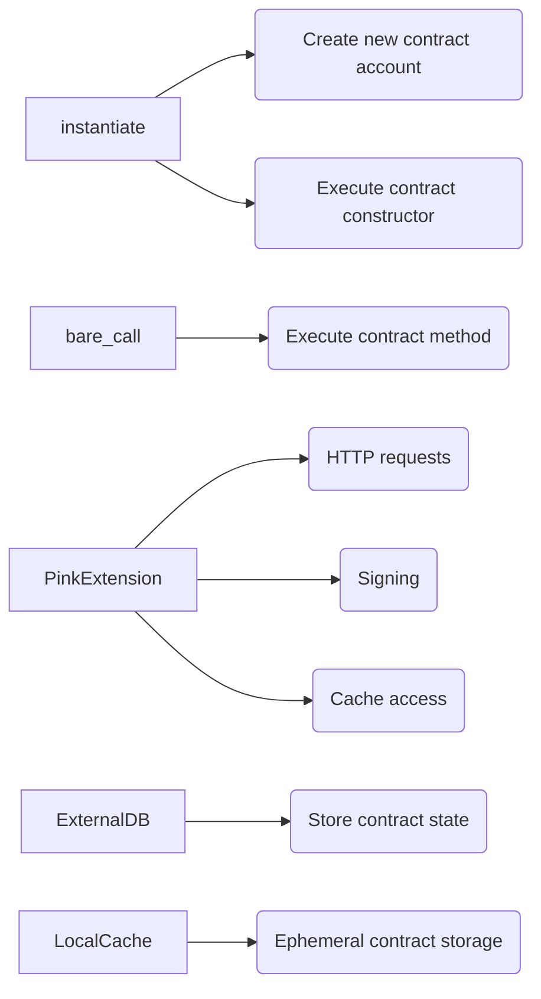
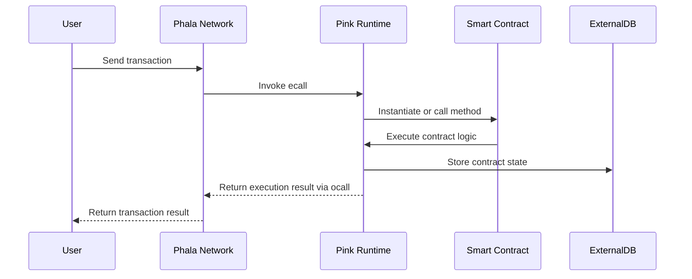
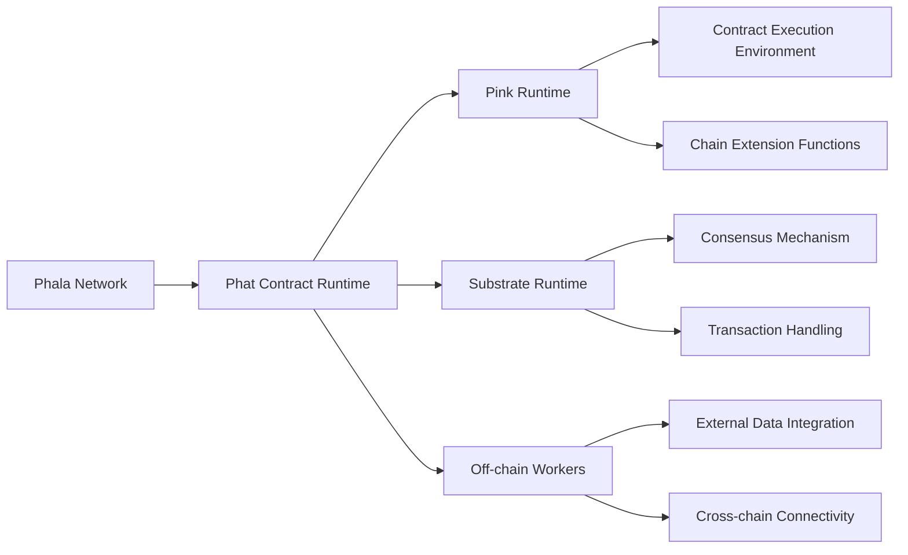

Concept behind Pink
-------------------

The key concept behind Pink is to provide a secure, isolated environment for executing smart contracts while leveraging the privacy and confidentiality features provided by Phala's Trusted Execution Environment (TEE). Contracts deployed on Pink are executed within the TEE, ensuring that contract state and execution remain confidential.

The Phat Contract Runtime, also known as Pink, is a Wasm-based smart contract execution environment designed for the Phala Network. It is built on top of Substrate's pallet-contracts module, which provides the base functionality for deploying and executing Wasm contracts. Pink extends this base functionality with additional features and integrations specific to the Phala Network.

System key components
--------------------

The Pink system consists of several key components:

1. **Pallet Contracts**: The base Substrate module that provides functionality for storing, instantiating, and executing Wasm smart contracts.

2. **Pink Runtime**: The core runtime environment that extends pallet-contracts with Phala-specific features and integrations.

3. **Chain Extensions**: Additional functionality exposed to smart contracts through the `PinkExtension` trait, including features like HTTP requests, signing, and cache access.

4. **Ecall/Ocall Interfaces**: The communication interfaces between the Pink runtime and the host environment (Phala Network). Ecalls allow the host to call into the runtime, while Ocalls allow the runtime to call out to the host.

5. **ExternalDB**: A storage abstraction that allows the Pink runtime to delegate contract state storage to the host environment.

6. **Local Cache**: An in-memory key-value store that provides ephemeral storage for contracts, with features like expiration and quota management.

Key functions and components in the Pink system
-------------------------------------------



Roles in the Pink System
---------------------

There are several key roles in the Pink system:

1. **Contract Developers**: Write and deploy smart contracts to be executed on the Pink runtime.

2. **End Users**: Interact with deployed contracts by calling their methods and sending transactions.

3. **Phala Network Validators**: Run the Phala Network nodes and execute the Pink runtime within the TEE.

4. **System Admin**: Responsible for setting up and maintaining the Pink runtime, including configuring system parameters and deploying system contracts.

Pink Workflow
-------------



In this workflow:

1. A user sends a transaction to the Phala Network to interact with a smart contract.
2. The Phala Network invokes the appropriate ecall on the Pink runtime to handle the transaction.
3. The Pink runtime either instantiates a new contract or calls a method on an existing contract, depending on the transaction type.
4. The smart contract executes its logic, which may involve interacting with the Pink runtime through chain extensions (e.g., making HTTP requests or accessing the cache).
5. The Pink runtime stores any changes to the contract state using the ExternalDB abstraction, which delegates to the host environment.
6. The execution result is returned to the Phala Network via an ocall.
7. The Phala Network returns the transaction result to the user.

Throughout this process, the Pink runtime ensures that contract execution remains isolated and confidential within the TEE.

Approach
--------

The analysis was conducted by performing a line-by-line review of the Rust source code, focusing on identifying potential bugs, vulnerabilities, edge cases, centralization risks, and risks of admin abuse. The review also considered the overall architecture, code quality, and systemic risks.

Architecture
------------

1. Contracts are executed within a sandboxed WebAssembly (Wasm) environment provided by pallet-contracts.
2. Pink extends this with custom functionality exposed through chain extensions, implemented in the `PinkExtension` struct.
3. Interaction between the host (Phala Network) and the Pink runtime happens through:
   - Ecalls (host calling into runtime), defined in `ecall` module
   - Ocalls (runtime calling out to host), defined in `ocall` module
4. State is persisted by using an `ExternalDB` which delegates storage operations to the host via ocalls. 
5. An in-memory `LocalCache` provides ephemeral storage for contracts.

High-level diagram of the architecture:

```
+-------------+         Ecalls          +-----------------+
|             | <----------------------- |                 |
|    Host     |                         |  Pink Runtime   |
|  (Phala)    | -----------------------> |                 |
+-------------+         Ocalls          |  +------------+  |
                                        |  | Contracts  |  |
                                        |  +------------+  |
                                        |  | Extensions |  |
                                        |  +------------+  |
                                        +-----------------+
                                                 ^
                                                 |
                                                 v
                                          +--------------+
                                          |  ExternalDB  |
                                          +--------------+
```

Analysis
--------

### Bugs and Vulnerabilities

No major bugs or vulnerabilities were identified in the reviewed code. However, some potential issues to consider:

1. The `ExternalDB` and `ExternalStorage` rely on the correctness and security of the host's storage implementation, as they delegate storage operations via ocalls. Any vulnerabilities in the host storage could impact Pink's security. (external_backend.rs)

2. The use of `unsafe` code in the `__pink_runtime_init` function and some FFI boundary definitions could lead to undefined behavior if not handled correctly. (mod.rs)

3. The correctness of the Wasm sandbox setup and memory limits are critical for isolating contracts. Misconfiguration could break contract isolation. (runtime.rs)

### Edge Cases

1. The `instantiate` and `bare_call` functions use the `mask_gas` function to limit gas usage. Edge cases around gas metering, like very low or high limits, should be thoroughly tested. (pallet_pink.rs)

2. Error handling edge cases, like when the `system_contract` is missing or `transfer` fails, should be exercised. (pallet_pink.rs, runtime.rs)

3. Quota enforcement and cache expiration in `LocalCache` rely on periodic garbage collection triggered by a `gc_interval`. Behavior under high contention or very low intervals should be considered. (local_cache.rs)

### Centralization Risks

1. The `setup` function, callable only by the host, sets critical parameters like the cluster ID, key, gas price, etc. These give significant control to the host. (mod.rs)

2. The `system_contract` has special privileges and its address is set by the host during setup. This contract has significant power. (pallet_pink.rs)

3. The treasury account that accumulates gas fees is also set by the host during setup. (ecall_impl.rs)

### Admin Abuse Risks

1. The host has control over the setup parameters and can change them at will, potentially impacting the economics and operation of all contracts in the cluster. (ecall_impl.rs)

2. An admin with access to the `system_contract` private key could abuse its privileged position to manipulate other contracts' state or balances. (pallet_pink.rs)

3. The allocation of cache quotas to contracts is not currently governed by the runtime and could potentially be abused by an admin. (local_cache.rs)

### Code Quality

The codebase is generally well-structured and follows Rust best practices. Some observations:

1. Good use of modularity and encapsulation, with separate modules for each major component (ecall, ocall, storage, etc.).
2. Consistent use of error handling via `Result` types.
3. Unsafe code is isolated and well-documented.
4. Unit tests are present for most modules, but coverage could be improved, especially around error and edge cases.

### Systemic Risks

1. Pink's security heavily relies on the security of the TEE and the correctness of the Wasm sandboxing. Any vulnerabilities in these components could lead to systemic risks.

2. The economic incentives and costs (gas price, storage deposits, etc.) need to be carefully balanced to ensure the sustainability and security of the system. Misconfiguration could lead to under- or over-pricing of resources.

3. The system's resilience to network-level attacks, like DDoS on the RPC endpoints or eclipse attacks on the off-chain workers, should be considered.

Findings and Potential Risks
--------------------

1. Input Validation and Sanitization:
   - The `bare_call` and `contract_instantiate` functions in `contract.rs` take user-controlled input data but lack proper input validation and sanitization. This could potentially lead to injection vulnerabilities or unintended behavior if malicious data is passed.
   - **Recommendation:** Implement strict input validation and sanitization measures to ensure that user-controlled data is properly checked and cleaned before being processed by the Pink Runtime.

2. Access Control and Authorization:
   - The `SystemContract` and `TreasuryAccount` roles in the `PinkRuntime` (`runtime.rs`) have significant privileges, such as setting cluster configurations and managing funds. However, the access control mechanisms for these roles are not clearly defined, which could lead to potential abuse or unauthorized access.
   - **Recommendation:** Implement robust access control mechanisms, such as multi-sig or timelocks, to ensure that critical operations performed by system contracts and treasury accounts are properly authorized and audited.

3. Secure Communication and Encryption:
   - The communication between the Pink Runtime and the host relies on the security of the SGX enclave. While the codebase assumes the integrity of the enclave, it is important to ensure that the communication channels are properly encrypted and authenticated to prevent unauthorized access or tampering.
   - **Recommendation:** Conduct a thorough review of the SGX enclave implementation and the communication protocols used between the Pink Runtime and the host to ensure their security and resistance to potential attacks.

4. Resource Management and DoS Protection:
   - The Pink Runtime allows the execution of complex off-chain computations and interactions with external APIs. However, there are no explicit mechanisms in place to prevent resource exhaustion or DoS attacks, such as rate limiting or gas metering.
   - **Recommendation:** Implement proper resource management techniques, such as gas metering and rate limiting, to prevent malicious actors from overwhelming the system with excessive computations or API calls.

5. Error Handling and Exception Management:
   - The codebase relies on the `anyhow` crate for error handling, which provides flexibility but may lead to inconsistent error handling across the system. Some functions, like `instantiate` and `bare_call`, return raw `Vec<u8>` without proper error propagation.
   - **Recommendation:** Establish a consistent and robust error handling mechanism throughout the Pink Runtime, ensuring that errors are properly propagated, logged, and handled to prevent unintended behavior or information leakage.

6. Timestamp Dependence and Manipulation:
   - The `timestamp` pallet is used within the Pink Runtime (`runtime.rs`), but there are no specific checks or validations for timestamp manipulation. Malicious actors could potentially exploit this to manipulate time-dependent functionalities.
   - **Recommendation:** Implement additional safeguards and checks to prevent timestamp manipulation, such as using block numbers instead of timestamps for critical operations and validating timestamp integrity.

7. Reentrancy and Recursive Calls:
   - The codebase does not explicitly address reentrancy vulnerabilities or recursive call issues. While the Substrate framework provides some built-in protections, it is important to ensure that the Pink Runtime and Phat Contracts are resilient to reentrancy attacks.
   - **Recommendation:** Conduct a thorough review of the contract execution flow and identify potential reentrancy risks. Implement necessary checks and controls to prevent unintended contract state changes due to reentrancy.

8. Arithmetic Overflows and Underflows:
   - The codebase utilizes Rust's built-in integer types and relies on the safety guarantees provided by the language. However, it is still important to be cautious of potential arithmetic overflows and underflows, especially when dealing with user-controlled inputs or large numbers.
   - **Recommendation:** Review the usage of arithmetic operations throughout the Pink Runtime and Phat Contracts, ensuring that proper bounds checking and safe math operations are used where necessary.

9. Randomness and Predictability:
   - The Pink Runtime utilizes the `pallet_insecure_randomness_collective_flip` for randomness generation (`runtime.rs`). However, this randomness source is not cryptographically secure and may be predictable.
   - **Recommendation:** Replace the insecure randomness source with a cryptographically secure random number generator (CSRNG) to ensure the integrity and unpredictability of random values used within the system.

10. External Dependencies and Third-Party Libraries:
    - The Pink Runtime and Phat Contract system rely on various external dependencies and third-party libraries, such as `pallet-contracts`, `pink-extension`, and `pink-capi`. It is crucial to ensure that these dependencies are up to date and free from known vulnerabilities.
    - **Recommendation:** Regularly audit and update the external dependencies used in the system. Stay informed about any security advisories or patches related to these libraries and promptly address any identified vulnerabilities.

Recommendations
---------------

1. Conduct a thorough security audit of the TEE setup and the Wasm sandboxing to ensure contracts are properly isolated.
2. Implement strict access controls and governance around privileged operations like setup and system contract deployment.
3. Consider implementing mechanisms to decentralize control over parameters like gas price, cache quotas, etc.
4. Improve test coverage, especially around error handling and edge cases.
5. Establish a bug bounty program to incentivize external security researchers to identify vulnerabilities.
6. Conduct regular security audits and economic analyses to identify and mitigate emerging risks.


Architecture Risks and Recommendations
--------------------------------------
The Phat Contract Runtime architecture follows a modular design, separating concerns into different components such as the Pink Runtime, Substrate Runtime, and Off-chain Workers. However, there are certain architectural risks and areas for improvement:

1. Tight Coupling between Components:
   - The Pink Runtime and Substrate Runtime have a high degree of coupling, which can make the system more complex and harder to maintain.
   - **Recommendation:** Consider a more loosely coupled architecture, using well-defined interfaces and abstractions to reduce dependencies between components.

2. Lack of Clear Separation of Concerns:
   - Some components, such as the Pink Runtime and Chain Extension Functions, have overlapping responsibilities and lack a clear separation of concerns.
   - **Recommendation:** Refactor the codebase to ensure a clear separation of concerns, with each component having a well-defined purpose and responsibility.

3. Potential Scalability Bottlenecks:
   - The current architecture may face scalability challenges when handling a large number of concurrent transactions and contract executions.
   - **Recommendation:** Conduct thorough performance testing and optimize critical paths to improve scalability. Consider implementing sharding or parallel processing techniques to distribute the workload.

**Codebase Quality Analysis:**
The Phat Contract Runtime codebase demonstrates good coding practices and follows Rust conventions. However, there are areas that can be improved:

1. Error Handling:
   - The codebase relies on the `anyhow` crate for error handling, which provides flexibility but may lead to inconsistent error handling across the system.
   - Some functions, such as `instantiate` and `bare_call`, return raw `Vec<u8>` without proper error propagation.
   - Recommendation: Establish a consistent error handling strategy using custom error types and ensure proper error propagation throughout the codebase.

2. Code Documentation:
   - While the codebase includes some comments and documentation, there are areas where the documentation is lacking or outdated.
   - Recommendation: Improve code documentation by providing clear and concise comments, explaining the purpose, inputs, and outputs of functions, and maintaining up-to-date documentation.

3. Input Validation and Sanitization:
   - Some functions, such as `bare_call` and `contract_instantiate`, lack proper input validation and sanitization, potentially leading to vulnerabilities.
   - Recommendation: Implement strict input validation and sanitization mechanisms to ensure the integrity and security of user-provided data.

Centralization
---------
The Phat Contract Runtime has certain centralization risks and potential for admin control abuse:

1. Concentration of Power in Admin Roles:
   - The `SystemContract` and `TreasuryAccount` roles have significant privileges and control over the system, without sufficient checks and balances.
   - Recommendation: Implement a multi-signature or threshold signature scheme for critical operations performed by admin roles, requiring multiple authorized entities to approve actions.

2. Lack of Decentralized Governance:
   - The current governance model relies heavily on the decision-making power of a few central entities, such as the Phat Contract Runtime developers or the Phala Network foundation.
   - Recommendation: Implement a more decentralized governance model, involving stakeholders and the community in the decision-making process through voting mechanisms and transparent proposal systems.

3. Potential for Censorship and Manipulation:
   - Admin roles have the ability to censor transactions, modify system parameters, or manipulate the runtime behavior.
   - Recommendation: Establish clear guidelines and limitations on the powers of admin roles, implement logging and auditing mechanisms to track admin actions, and consider using time-lock contracts or other safeguards to prevent arbitrary changes.

Mechanism Review:
---------------
The Phat Contract Runtime incorporates several key mechanisms, including the consensus algorithm, transaction handling, and contract execution. While these mechanisms are generally well-designed, there are potential vulnerabilities and areas for improvement:

1. Consensus Mechanism:
   - The consensus mechanism used in the Phat Contract Runtime is not clearly specified in the provided codebase.
   - Recommendation: Conduct a thorough security analysis of the consensus mechanism, ensuring its resilience against known attacks such as long-range attacks, nothing-at-stake problems, and network partitioning.

2. Transaction Handling:
   - The transaction handling logic, including gas payment and refund, may be vulnerable to race conditions and potential manipulation.
   - Recommendation: Implement proper synchronization mechanisms and atomic operations to prevent race conditions and ensure the integrity of transaction processing.

3. Contract Execution:
   - The contract execution environment lacks sufficient sandboxing and isolation, potentially allowing contracts to access and manipulate sensitive runtime data.
   - Recommendation: Strengthen the isolation and sandboxing mechanisms of the contract execution environment, using techniques like WebAssembly (Wasm) or a dedicated virtual machine to prevent unauthorized access and ensure the security of the runtime.

Systemic Risks:
-------------
The Phat Contract Runtime faces certain systemic risks that can impact its overall stability, scalability, and resilience:

1. Network Congestion and Scalability:
   - The runtime may experience network congestion and performance degradation when handling a high volume of transactions and contract executions.
   - Recommendation: Optimize the network communication protocols, implement efficient message propagation mechanisms, and explore sharding or parallel processing techniques to improve scalability.

2. Resource Exhaustion and DoS Attacks:
   - The runtime is vulnerable to resource exhaustion attacks, where malicious actors can exploit expensive computations or inefficient resource management to degrade system performance.
   - Recommendation: Implement proper resource management techniques, such as gas metering, rate limiting, and resource quotas, to prevent resource exhaustion and mitigate the impact of DoS attacks.

3. Failure Recovery and Resilience:
   - The runtime's ability to recover from failures and maintain data integrity in the face of network disruptions or node failures is not thoroughly addressed in the codebase.
   - Recommendation: Implement robust failure recovery mechanisms, such as checkpointing, state snapshotting, and data replication, to ensure the system can recover from failures and maintain data consistency.

Conclusion:
The Phat Contract Runtime demonstrates a solid foundation for executing smart contracts and building decentralized applications. However, the analysis has identified several risks, vulnerabilities, and areas for improvement in terms of architecture, code quality, centralization, and systemic resilience.

To enhance the security and robustness of the Phat Contract Runtime, it is recommended to address the identified issues by refactoring the codebase, implementing secure coding practices, strengthening the governance model, and conducting thorough testing and auditing.

By prioritizing the mitigation of centralization risks, improving the mechanisms for consensus and contract execution, and ensuring the system's scalability and resilience, the Phat Contract Runtime can provide a more secure and trustworthy platform for deploying and executing smart contracts on the Phala Network.

Appendix:
--------
The following code snippets and diagrams illustrate some of the key findings and recommendations:

1. Architecture Diagram:


2. Error Handling Code Snippet:
```rust
// Example of inconsistent error handling
pub fn instantiate(
    code_hash: Hash,
    input_data: Vec<u8>,
    salt: Vec<u8>,
    mode: ExecutionMode,
    args: TransactionArguments,
) -> ContractInstantiateResult {
    // ...
    let result = contract_tx(origin.clone(), gas_limit, gas_free, move || {
        Contracts::bare_instantiate(
            // ...
        )
    });
    // ...
    result
}
```

3. Admin Control Abuse Mitigation:
```rust
// Example of implementing multi-signature for admin actions
fn perform_admin_action(action: AdminAction) -> Result<(), Error> {
    let required_signatures = 2; // Require 2 out of 3 admin signatures
    let valid_signatures = 0;

    for admin in ADMIN_LIST.iter() {
        if is_valid_signature(admin, &action) {
            valid_signatures += 1;
        }
    }

    if valid_signatures >= required_signatures {
        execute_admin_action(action)
    } else {
        Err(Error::InsufficientAdminSignatures)
    }
}
```

### Time spent:
34 hours