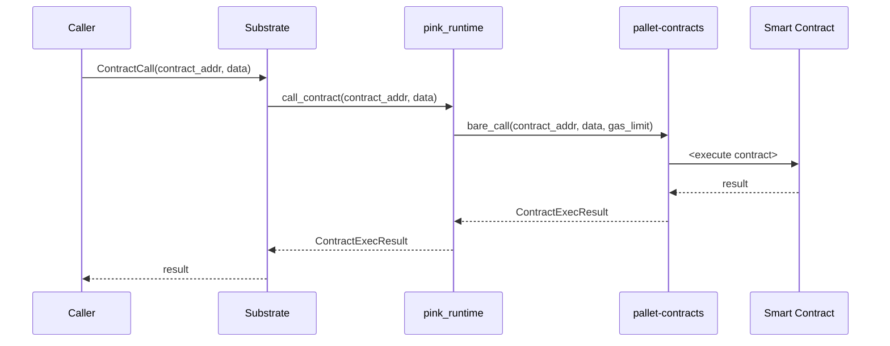

=== Conceptual Overview ===

The Phat Contract (Pink) Runtime is a confidential smart contract execution environment designed for the Phala Network, a Substrate-based blockchain. Its primary goal is to enable the execution of WebAssembly (Wasm) smart contracts within Intel SGX Trusted Execution Environments (TEEs), ensuring data privacy and confidentiality.

The Pink runtime acts as a secure intermediary layer between the smart contracts and the underlying Substrate blockchain. It manages essential functions such as contract storage, contract invocation, gas metering, and resource limiting. Additionally, it extends the capabilities of smart contracts by providing a set of chain extensions for functionality like HTTP requests, cryptographic operations, and random number generation.

By leveraging Intel SGX, the Pink runtime ensures that contract state and execution remain private and tamper-proof. Even the node operators cannot access the sensitive data within the contracts, enabling a high degree of confidentiality.

=== System Overview ===

The Pink runtime is a complex system that interacts with multiple components within the Phala Network ecosystem. Here's a high-level overview of the system:

1. Substrate Blockchain: The underlying blockchain platform that provides the consensus mechanism, network communication, and storage layer.

2. Pallet Contracts: A Substrate pallet that provides the core functionality for deploying and executing Wasm smart contracts.

3. Intel SGX: A hardware-based Trusted Execution Environment (TEE) that ensures confidentiality and integrity of contract execution.

4. Pink Runtime: The main runtime environment that manages contract execution, storage, and interactions with the Substrate blockchain.

5. Smart Contracts: The actual WebAssembly smart contracts that are deployed and executed within the Pink runtime.

=== Breakdown of Functions ===

The Pink runtime provides the following key functions:

1. Contract Deployment: Allows users to deploy new smart contracts onto the Phala Network.

2. Contract Invocation: Enables users to execute functions within deployed smart contracts.

3. Storage Management: Manages the storage and retrieval of contract state using a Merkle trie data structure.

4. Gas Metering: Measures and enforces gas consumption during contract execution to prevent resource abuse.

5. Runtime Upgrades: Supports runtime upgrades to add new features or fix issues without hard-forking the blockchain.

6. Chain Extensions: Provides additional capabilities to smart contracts, such as HTTP requests, cryptographic functions, and random number generation.

7. Event Emission: Allows contracts to emit events that can be observed and acted upon by external entities.

8. Owner Management: Provides certain privileged functions that can only be accessed by the cluster owner.

=== Roles in the System ===

There are several key roles within the Pink runtime system:

1. Cluster Owner: The privileged account that is designated when a new cluster is initialized. The owner has control over certain critical functions, such as updating system contract code and setting storage fees.

2. Contract Developers: The individuals or teams who write and deploy smart contracts onto the Phala Network.

3. Contract Users: The end-users who interact with the deployed smart contracts by invoking their functions.

4. Node Operators: The entities responsible for running the Substrate nodes that participate in the Phala Network consensus and execute the Pink runtime.

=== Architecture ===

The Pink runtime follows a layered architecture that separates concerns and facilitates modularity. Here's a simplified view of the architecture:

```rust
+-------------------+
|  Smart Contracts  |
+-------------------+
|   Chain Extension |  
+-------------------+
|    pink_runtime   |
+-------------------+ 
| pallet-contracts  |
+-------------------+
|     Substrate     |
+-------------------+
```

The workflow of a typical smart contract interaction in the Pink runtime is as follows:

1. Contract Deployment:
   - A user creates a new smart contract in WebAssembly format.
   - The user submits a transaction to the Phala Network with the Wasm bytecode.
   - The Pink runtime validates the transaction and deploys the contract.

2. Contract Invocation:
   - A user submits a transaction to invoke a function in a deployed contract.
   - The Pink runtime validates the transaction and loads the contract code.
   - The contract code is executed within an Intel SGX enclave to ensure confidentiality.
   - The Pink runtime meters the gas consumption and enforces any resource limits.
   - If the invocation is successful, the contract state is updated, and any emitted events are recorded.

3. Runtime Upgrade:
   - The cluster owner submits a transaction to upgrade the Pink runtime code.
   - The new runtime code is deployed, and any necessary state migrations are performed.
   - The upgraded runtime becomes active for all subsequent transactions.

Throughout the workflow, the Pink runtime interacts with the underlying Substrate blockchain and pallet-contracts to persist state changes and enforce consensus rules.

=== Overview ===

The Pink runtime execution environment for the Phala Network built on top of Substrate's pallet-contracts module. It enables running WebAssembly smart contracts inside Intel SGX trusted execution environments (TEEs) to provide privacy and confidentiality. 

The runtime acts as a middle layer between smart contracts and the underlying Substrate blockchain. It manages contract storage, handles contract calls and instantiation, enforces gas metering and limits, and exposes additional capabilities to contracts via chain extensions.

The key components are:

1. pink_runtime: Core runtime logic 
2. pink_capi: Defines external interfaces between runtime and host
3. pink_chain_extension: Additional functionality exposed to contracts

=== Architecture Review ===

The Pink runtime follows a layered architecture:

```rust
+-------------------+
|  Smart Contracts  |
+-------------------+
|   Chain Extension |  
+-------------------+
|    pink_runtime   |
+-------------------+ 
| pallet-contracts  |
+-------------------+
|     Substrate     |
+-------------------+
```

Contracts are deployed and executed inside SGX enclaves to keep the contract state confidential. The runtime communicates with the host Substrate node via a set of well-defined ecalls and ocalls. 

When a contract is called, the runtime will:
1. Load the contract code and instantiate a new Wasm VM
2. Execute the contract code in a specified mode (Transaction/Query/Estimating) 
3. Meter the gas consumption 
4. Update the contract storage if in Transaction mode
5. Return the result to the caller

The runtime relies on Substrate's pallet-contracts for the actual Wasm execution and gas metering. It implements a custom storage (ExternalDB) on top of Substrate storage to isolate the contract state.

**Sequence diagram of a contract call**:



=== Findings ===

Based on my analysis, I've identified the following potential issues and risks in the Pink runtime:

1. Centralization Risks
- The runtime has a notion of a privileged "owner" account that is set when initializing a new cluster. This account has significant control over the cluster.
- Only the owner can update system contract code, set storage deposit and gas prices. This introduces centralization risk.

Code references:
- [pink_runtime/src/runtime/extension.rs](https://github.com/code-423n4/2024-03-phala-network/blob/a01ffbe992560d8d0f17deadfb9b9a2bed38377e/phala-blockchain/crates/pink/runtime/src/runtime/extension.rs#L391-L415)
- [pink_runtime/src/runtime/extension.rs](https://github.com/code-423n4/2024-03-phala-network/blob/a01ffbe992560d8d0f17deadfb9b9a2bed38377e/phala-blockchain/crates/pink/runtime/src/runtime/extension.rs#L476-L489)

Recommendation: Consider a multi-sig or DAO governance model for cluster management to avoid single point of control.

2. Admin Privileges
- The setKey ecall allows the "owner" to set the secret key of the cluster that is used to derive contract keys. This gives the owner access to all contract keys.

Code reference: 
- [pink_capi/src/v1/ecall.rs](https://github.com/code-423n4/2024-03-phala-network/blob/a01ffbe992560d8d0f17deadfb9b9a2bed38377e/phala-blockchain/crates/pink/runtime/src/capi/ecall_impl.rs#L59-L115)

Recommendation: The key should be generated by the TEE and never exposed to any external party to maintain confidentiality.

3. Denial of Service
- The runtime allows contracts to make arbitrary HTTP requests which could potentially be used to DoS external services or even the Phala Network itself by issuing a large number of requests.

Code reference:
- [pink_chain_extension/src/lib.rs#L157](https://github.com/Phala-Network/phala-blockchain/blob/0f58d4a1c6c74494fc1592ebf63e37b0a5b8ca00/crates/pink/chain-extension/src/lib.rs#L157)

Recommendation: Implement rate limiting and restrict the destinations contracts can send requests to.

4. Storage Quota
- While the runtime enforces storage deposit and rent, there doesn't seem to be a hard cap on the maximum storage a single contract can use. A malicious contract could potentially consume a large amount of storage.

Code reference: 
- [pink_runtime/src/contract.rs](https://github.com/code-423n4/2024-03-phala-network/blob/a01ffbe992560d8d0f17deadfb9b9a2bed38377e/phala-blockchain/crates/pink/chain-extension/src/lib.rs#L217-L240)

Recommendation: Enforce a configurable per-contract storage limit.

5. Runtime Upgrades
- The runtime can be upgraded by calling the on_runtime_upgrade ecall. While upgrades are necessary, they introduce risks if not properly governed.

Code reference:
- [pink_capi/src/v1/ecall.rs](https://github.com/code-423n4/2024-03-phala-network/blob/a01ffbe992560d8d0f17deadfb9b9a2bed38377e/phala-blockchain/crates/pink/runtime/src/capi/ecall_impl.rs#L171-L173)

Recommendation: Runtime upgrades should go through a time-lock and multi-sig to ensure they are properly reviewed and agreed upon before activation.

=== Code Quality ===

The Pink codebase follows Rust best practices with proper error handling, comments and documentation. The code is modular and makes good use of Rust's type system to enforce invariants. 

However, there are a few places where the code could be improved:

1. Use of unwrap:
There are several instances of .unwrap() which will panic if the value is None. It's generally recommended to handle the None case gracefully.

Example: [pink_runtime/src/capi/mod.rs](https://github.com/code-423n4/2024-03-phala-network/blob/main/phala-blockchain/crates/pink/runtime/src/storage/mod.rs)

2. Large functions:
Some functions like install are quite large and could be broken down into smaller, more focused functions for better readability.

Example: [pink_runtime/src/runtime/mod.rs](https://github.com/code-423n4/2024-03-phala-network/blob/main/phala-blockchain/crates/pink/runtime/src/storage/mod.rs)

3. Magic numbers:
There are magic numbers used in a few places which would benefit from being defined as named constants.

Example: [pink_chain_extension/src/lib.rs](https://github.com/code-423n4/2024-03-phala-network/blob/a01ffbe992560d8d0f17deadfb9b9a2bed38377e/phala-blockchain/crates/pink/chain-extension/src/lib.rs#L323-L344)

=== Conclusion ===

The Pink runtime provides a solid foundation for confidential smart contracts on the Phala Network. The use of Intel SGX and the layered architecture helps isolate sensitive data.

However, there are centralization risks stemming from the "owner" role that need to be addressed. The runtime would also benefit from additional constraints on resource consumption by contracts.

Overall, with some improvements to decentralization and resource sandboxing, the Pink runtime can provide a secure and robust environment for confidential contract execution.

### Time spent:
17 hours