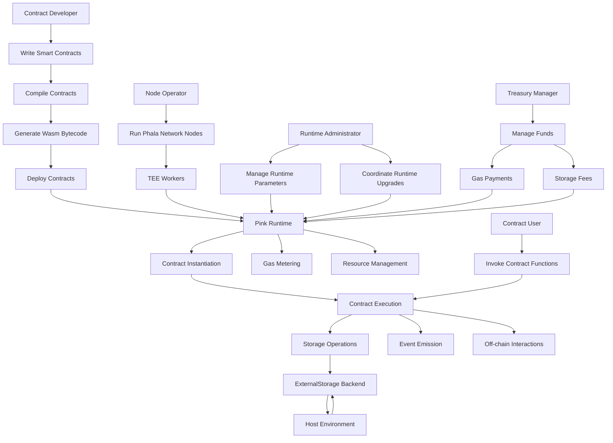

### Diagram illustrating the architecture and workflow of the Phat Contract Runtime (Pink Runtime) within the Phala Network



1. Contract developers write smart contracts using the ink! language, compile them, and generate the corresponding Wasm bytecode.
2. The compiled contracts are deployed to the Phala Network through the Pink Runtime's contract instantiation process.
3. Contract users invoke the deployed contract functions, triggering the contract execution within the Pink Runtime.
4. During contract execution, the Pink Runtime interacts with the ExternalStorage backend for storage operations, delegating them to the host environment.
5. The Pink Runtime also facilitates event emission, allowing contracts to emit events that can be captured and processed by external systems.
6. Contracts can perform off-chain interactions, such as making HTTP requests or accessing external APIs, through the Pink Runtime's custom chain extensions.
7. The Pink Runtime continuously monitors gas consumption and manages the allocation of computational resources to ensure fair and efficient execution.
8. Node operators run Phala Network nodes, which include TEE workers that host the Pink Runtime and execute smart contracts securely.
9. The runtime administrator manages the runtime parameters and coordinates runtime upgrades to introduce new features, fix bugs, or optimize performance.
10. The treasury manager oversees the funds collected from gas payments and storage fees, ensuring their proper allocation and utilization.

# Overview of the Phat Contract Runtime

The Phat Contract Runtime, also known as Pink Runtime, is a smart contract execution engine for the Phala Network. It is built on top of Substrate's `pallet-contracts` module and includes custom chain extensions. The runtime is compiled into a shared library (`libpink.so`) and runs inside Trusted Execution Environment (TEE) workers of the Phala Network.

The Phat Contract Runtime, also known as Pink Runtime, is a smart contract execution environment designed specifically for the Phala Network. It serves as the foundation for running ink! smart contracts within the network's Trusted Execution Environment (TEE) workers. The Pink Runtime is built on top of Substrate's `pallet-contracts` module and incorporates custom chain extensions to provide additional functionality and security features.

The primary goal of the Pink Runtime is to enable secure, efficient, and flexible execution of smart contracts while leveraging the benefits of TEE technology. It aims to provide developers with a familiar and intuitive programming model based on ink!, a Rust-based embedded domain-specific language (eDSL) for writing smart contracts.

### Architecture Risks and Recommendations

1. Dependency on Substrate's `pallet-contracts`:
   - **Risk**: The Pink Runtime heavily relies on Substrate's `pallet-contracts` module. Any vulnerabilities or issues in the underlying module could potentially impact the security of the Pink Runtime.
   - **Recommendation**: Regularly update and audit the `pallet-contracts` module to ensure its security and stability.

2. TEE Worker Security:
   - **Risk**: The Pink Runtime runs inside TEE workers, which are assumed to provide a secure execution environment. However, if the TEE is compromised, it could lead to the execution of malicious code or unauthorized access to sensitive data.
   - **Recommendation**: Implement robust security measures to protect the TEE workers, such as secure key management, attestation mechanisms, and regular security audits.

3. External Dependencies:
   - **Risk**: The Pink Runtime relies on external dependencies, such as the `pink` and `pink-capi` crates. Vulnerabilities in these dependencies could introduce risks to the runtime.
   - **Recommendation**: Regularly update and audit the external dependencies to ensure their security and compatibility with the Pink Runtime.

### Workflow

The Pink Runtime follows a layered architecture that integrates with the Phala Network's infrastructure.

1. Smart Contract Development:
   - Contract developers write smart contracts using the ink! language.
   - They compile the contracts and generate the corresponding WebAssembly (Wasm) bytecode.

2. Contract Deployment:
   - The contract bytecode is uploaded to the Phala Network through the `contract_instantiate` ecall.
   - The Pink Runtime validates the contract code and initializes its state.
   - The contract is deployed within the TEE worker, and its address is generated.

3. Contract Execution:
   - Contract users invoke the deployed contract's functions through the `contract_call` ecall.
   - The Pink Runtime processes the function call and executes the contract code within the TEE worker.
   - The runtime manages the contract's state changes and gas consumption.

4. Storage Operations:
   - During contract execution, the Pink Runtime interacts with the ExternalStorage backend for storage operations.
   - The runtime delegates storage reads and writes to the host environment via ocalls.
   - The host environment performs the actual storage operations and returns the results to the runtime.

5. Event Emission:
   - Smart contracts can emit events during their execution using the Pink Runtime's event system.
   - The emitted events are captured by the runtime and propagated to the host environment.
   - External systems can subscribe to and process these events for various purposes.

6. Off-chain Interactions:
   - Smart contracts can interact with off-chain systems and retrieve external data using the custom chain extensions.
   - The runtime provides functions for making HTTP requests, accessing external APIs, and performing other off-chain operations.
   - The results of these interactions are returned to the smart contracts for further processing.

7. Gas Metering and Resource Management:
   - The Pink Runtime continuously monitors the gas consumption of executing smart contracts.
   - It enforces gas limits and charges the corresponding fees to the contract users.
   - The runtime also manages the allocation of computational resources to ensure fair and efficient execution.

8. Runtime Upgrades and Maintenance:
   - The Pink Runtime may undergo upgrades and maintenance to introduce new features, fix bugs, or optimize performance.
   - The runtime administrator is responsible for coordinating and executing these upgrades.
   - The upgrades are performed in a controlled manner to minimize disruption to the network and ensure backward compatibility.

## Codebase Quality Analysis

The Pink Runtime codebase follows a modular and well-organized structure. The code is written in Rust, which provides strong type safety and memory safety guarantees. The use of traits and abstractions, such as `ExternalStorage` and `ChainExtension`, promotes code reusability and maintainability.

However, there are a few areas that could be improved:

1. Error Handling:
   - Observation: The codebase uses a mix of `Result` types and panics for error handling. Panics should be avoided in production code as they can lead to abrupt termination of the runtime.
   - Recommendation: Consistently use `Result` types for error handling and propagate errors to the caller for proper error management.

2. Documentation:
   - Observation: While the codebase includes some comments and documentation, there are still areas that could benefit from more detailed explanations and examples.
   - Recommendation: Improve the documentation by adding more comments, providing usage examples, and explaining the purpose and behavior of key components and functions.

3. Testing:
   - Observation: The codebase includes some unit tests, but the test coverage could be further improved to ensure the correctness and robustness of the runtime.
   - Recommendation: Expand the test suite to cover more scenarios, edge cases, and potential failure points. Consider adding integration tests to validate the interaction between different components.

### Functions

The Pink Runtime provides a range of functions and features to support the execution of smart contracts. Some of the key functions include:

1. The runtime allows the deployment of new smart contracts by uploading their code and initializing their state. This process is facilitated by the `contract_instantiate` ecall.

2. Once deployed, smart contracts can be executed by invoking their functions through the `contract_call` ecall. The runtime handles the execution of the contract code and manages the associated state changes.

3. The Pink Runtime incorporates a gas metering system to measure and limit the computational resources consumed by smart contracts during execution. This helps prevent excessive resource usage and ensures fair allocation among different contracts.

4. The runtime provides functions for reading from and writing to the contract storage. It utilizes the ExternalStorage backend to delegate storage operations to the host environment via ocalls.

5. The Pink Runtime offers cryptographic functions, such as signing, verification, and key derivation, through the custom chain extensions. These functions enable secure interactions between smart contracts and external entities.

6. Smart contracts can emit events during their execution using the event system provided by the Pink Runtime. These events can be captured and processed by external systems for various purposes.

7. The runtime includes functions for retrieving off-chain data, such as making HTTP requests, through the custom chain extensions. This allows smart contracts to access external data sources and integrate with other systems.

## Centralization Risks

### Roles

1. The contract developer is responsible for writing and deploying smart contracts using the ink! language. They interact with the Pink Runtime through the provided APIs and follow the guidelines and best practices for secure and efficient contract development.

2. Contract users are entities that interact with deployed smart contracts by invoking their functions and participating in transactions. They can be external users, other smart contracts, or off-chain systems.

3. Node operators are responsible for running the Phala Network nodes that host the TEE workers. They ensure the availability and security of the network infrastructure and may also participate in consensus and governance activities.

4. The runtime administrator has privileged access to certain runtime functions and configurations. They are responsible for managing the runtime's parameters, such as gas prices, storage fees, and system contracts.

5. The treasury manager oversees the funds collected from gas payments and storage fees. They ensure the proper allocation and utilization of these funds in accordance with the network's governance policies.

1. Owner Privileges:
   - **Risk**: The Owner account has significant control over the Pink Runtime, as it is responsible for setting up the initial configuration through the "setup" ecall. If the Owner account is compromised or acts maliciously, it could potentially manipulate the runtime's behavior.
   - **Recommendation**: Implement a multi-signature scheme or a governance mechanism to distribute the control and mitigate the risk of a single point of failure.

2. SystemContract Privileges:
   - **Risk**: The SystemContract account seems to have elevated privileges within the Pink Runtime. If the SystemContract is compromised or abused, it could potentially perform unauthorized actions or access sensitive data.
   - **Recommendation**: Clearly define and limit the privileges of the SystemContract account. Implement strict access controls and auditing mechanisms to monitor and restrict its actions.

3. Treasury Account:
   - **Risk**: The Treasury account collects gas payments and storage fees. If the Treasury account is not properly managed or secured, it could be subject to unauthorized withdrawals or misuse of funds.
   - **Recommendation**: Implement robust security measures to protect the Treasury account, such as multi-signature controls, regular audits, and transparency in fund management.

## Mechanism Review

1. Gas Metering and Weights:
   - **Explanation**: The Pink Runtime uses gas metering and weights to limit the execution time and resources consumed by smart contracts. This helps prevent denial-of-service attacks and ensures fair resource allocation among contracts.
   - **Recommendation**: Regularly review and update the gas metering and weight system to ensure its effectiveness and alignment with the network's requirements. Consider implementing dynamic gas pricing to adapt to network conditions.

2. Contract Execution Modes:
   - **Explanation**: The Pink Runtime supports two contract execution modes: Transaction mode and Query mode. Transaction mode is used for regular transactions that update the state and enforces determinism, while Query mode is used for read-only queries and allows some indeterminism.
   - **Recommendation**: Clearly document the differences between the two modes and provide guidelines for developers to choose the appropriate mode based on their contract's requirements. Implement strict validation and error handling to prevent unintended behavior in each mode.

3. Event System:
   - **Explanation**: The Pink Runtime includes an event system to record and emit contract events, both from ink! contracts and custom PinkEvents. Events provide transparency and enable off-chain monitoring and indexing of contract activities.
   - **Recommendation**: Ensure that the event system is properly implemented and validated to prevent unauthorized event emission or tampering. Consider implementing event filters and access controls to restrict access to sensitive events.

## Systemic Risks

1. Scalability:
   - **Risk**: As the Phala Network grows and the number of smart contracts increases, the Pink Runtime may face scalability challenges. If the runtime is not optimized for high throughput and efficient resource utilization, it could lead to performance degradation and increased costs.
   - **Recommendation**: Continuously monitor and optimize the Pink Runtime's performance. Consider implementing sharding techniques or off-chain computation mechanisms to distribute the workload and improve scalability.

2. Interoperability:
   - **Risk**: The Pink Runtime is built on top of Substrate and uses custom chain extensions. Compatibility issues or changes in the underlying infrastructure could affect the interoperability and stability of the runtime.
   - **Recommendation**: Maintain close alignment with the Substrate ecosystem and ensure that the Pink Runtime is compatible with the latest versions of Substrate and its associated modules. Regularly test and validate the runtime's interoperability with other components of the Phala Network.

3. Upgrade Mechanism:
   - **Risk**: The Pink Runtime may require upgrades or modifications over time to address vulnerabilities, add new features, or optimize performance. If the upgrade mechanism is not properly designed or executed, it could introduce risks and disrupt the network's operation.
   - **Recommendation**: Implement a robust and secure upgrade mechanism for the Pink Runtime. Ensure that upgrades are thoroughly tested and validated before deployment. Consider using a phased rollout approach and providing a fallback mechanism in case of issues.

### Code Snippets and Specific Lines of Code

1. Potential Issue: Panic in `set_ocall_fn` ([crates/pink/runtime/src/capi/ocall_impl.rs:18-34](https://github.com/code-423n4/2024-03-phala-network/blob/a01ffbe992560d8d0f17deadfb9b9a2bed38377e/phala-blockchain/crates/pink/runtime/src/capi/ocall_impl.rs#L18-L34))

```rust
pub(super) fn set_ocall_fn(ocalls: ocalls_t) -> Result<(), &'static str> {
    let Some(ocall) = ocalls.ocall else {
        return Err("No ocall function provided");
    };
    unsafe {
        OCALL = ocall;
        #[cfg(feature = "allocator")]
        if let Some(alloc) = ocalls.alloc {
            allocator::ALLOC_FUNC = alloc;
        }
        #[cfg(feature = "allocator")]
        if let Some(dealloc) = ocalls.dealloc {
            allocator::DEALLOC_FUNC = dealloc;
        }
    }
    Ok(())
}
```

**Explanation**: The `set_ocall_fn` function uses `unsafe` blocks to set the `OCALL`, `ALLOC_FUNC`, and `DEALLOC_FUNC` function pointers. If these pointers are not properly validated or if they are set to invalid or malicious functions, it could lead to undefined behavior or security vulnerabilities.

**Recommendation**: Ensure that the `ocalls` parameter is properly validated before setting the function pointers. Consider implementing additional safety checks and error handling to prevent the setting of invalid or malicious function pointers.

2. Potential Issue: Unchecked `unwrap` in `storage_root` ([crates/pink/runtime/src/storage/external_backend.rs:42-45](https://github.com/code-423n4/2024-03-phala-network/blob/a01ffbe992560d8d0f17deadfb9b9a2bed38377e/phala-blockchain/crates/pink/runtime/src/storage/external_backend.rs#L41-L47))

```rust
pub fn instantiate() -> Self {
    let root = OCallImpl
        .storage_root()
        .unwrap_or_else(sp_trie::empty_trie_root::<sp_state_machine::LayoutV1<Hashing>>);
    let backend = TrieBackendBuilder::new(ExternalDB, root).build();
    crate::storage::Storage::new(backend)
}
```

**Explanation**: The `instantiate` function uses `unwrap_or_else` to retrieve the storage root from `OCallImpl.storage_root()`. If the `storage_root` function returns `None`, it falls back to an empty trie root. However, if the `storage_root` function itself panics or returns an invalid value, it could lead to unexpected behavior or runtime errors.

**Recommendation:** Handle the case when `OCallImpl.storage_root()` returns `None` more gracefully. Consider logging an error or returning an error type instead of using `unwrap_or_else`. Additionally, ensure that the `storage_root` function is properly implemented and tested to avoid panics or invalid return values.

3. Potential Issue: Unhandled `Err` variant in `mask_low_bits128` ([crates/pink/runtime/src/contract.rs:75-84](https://github.com/code-423n4/2024-03-phala-network/blob/a01ffbe992560d8d0f17deadfb9b9a2bed38377e/phala-blockchain/crates/pink/runtime/src/contract.rs#L75-L84))

```rust
define_mask_fn!(mask_low_bits128, 128, u128);

fn mask_deposit(deposit: u128, deposit_per_byte: u128) -> u128 {
    const MIN_MASKED_BYTES: u128 = 256;
    let min_masked_value = deposit_per_byte
        .saturating_mul(MIN_MASKED_BYTES)
        .saturating_sub(1);
    let min_mask_bits = 128 - min_masked_value.leading_zeros();
    mask_low_bits128(deposit, min_mask_bits)
}
```

**Explanation**: The `mask_low_bits128` macro is used to mask the low bits of a `u128` value. However, the macro does not handle the case when the `min_mask_bits` is greater than 128, which could lead to unexpected behavior or runtime errors.

**Recommendation**: Modify the `mask_low_bits128` macro to properly handle the case when `min_mask_bits` is greater than 128. Consider adding a check to ensure that `min_mask_bits` is within the valid range (0 to 128) and return an error or use a default value if it exceeds the range.

### Overview

The Pink Runtime consists of several key components that work together to facilitate the execution of smart contracts:

1. Trusted Execution Environment (TEE) Workers: The Pink Runtime operates within the TEE workers of the Phala Network. These workers provide a secure and isolated environment for executing smart contracts, protecting them from unauthorized access and tampering.

2. `pallet-contracts` Module: The Pink Runtime is built on top of Substrate's `pallet-contracts` module, which provides the core functionality for managing and executing smart contracts. It handles tasks such as contract deployment, storage, and gas metering.

3. Custom Chain Extensions: The Pink Runtime introduces custom chain extensions that extend the capabilities of the `pallet-contracts` module. These extensions include additional APIs and features specific to the Phala Network, such as cryptographic operations, cache management, and off-chain data retrieval.

4. ExternalStorage Backend: The Pink Runtime utilizes an ExternalStorage backend that implements the TrieBackendStorage trait. This backend allows the runtime to delegate key-value storage operations to the host environment via ocalls (outside calls), rather than managing the storage directly.

5. Ecall and Ocall Interfaces: The Pink Runtime defines a set of ecall and ocall interfaces that facilitate communication between the runtime and the host environment. Ecalls are incoming calls from the host to the runtime, while ocalls are outgoing calls from the runtime to the host.

6. Event System: The Pink Runtime includes an event system that allows smart contracts to emit events during execution. These events can be captured and processed by external systems for various purposes, such as monitoring, indexing, or triggering further actions.

## Conclusion

The Pink Runtime is a critical component of the Phala Network, enabling the execution of smart contracts within a Trusted Execution Environment. While the codebase follows a modular and well-organized structure, there are areas that require further attention to ensure its security, scalability, and robustness.

In the analysis I highlighted potential risks related to centralization, admin control abuse, and systemic issues. It is crucial to implement appropriate mitigation measures, such as multi-signature schemes, access controls, and regular audits, to address these risks.

Furthermore, the codebase quality can be improved by enhancing error handling, documentation, and testing. Regular updates and security audits of external dependencies are also recommended to maintain the runtime's security and compatibility.

To ensure the long-term success and resilience of the Pink Runtime, it is essential to continuously monitor and optimize its performance, scalability, and interoperability. Implementing a robust upgrade mechanism and following best practices for secure coding and deployment will help mitigate risks and maintain the trust of the Phala Network community.

### Time spent:
40 hours