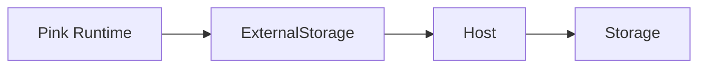
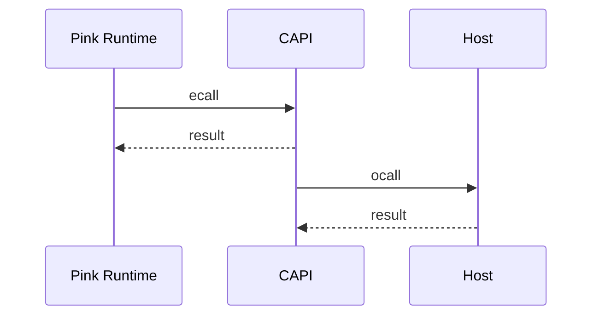

**Overview of the Phat Contract Runtime**
------------------------------

The Phat Contract Runtime, also known as the Pink runtime, is a confidential smart contract execution environment built on top of the Substrate framework. It is designed to run on Phala Network's off-chain Trusted Execution Environment (TEE) workers, providing a secure and privacy-preserving platform for executing smart contracts.

The Pink runtime leverages Substrate's pallet-contracts module, which allows for the deployment and execution of WebAssembly (Wasm) based smart contracts. The runtime extends the functionality of pallet-contracts by adding a layer of confidentiality and additional features tailored for the Phala Network ecosystem.

**System**
-------

The Pink runtime consists of several key components that work together to provide a confidential and secure smart contract execution environment:

1. Substrate Framework: The Pink runtime is built on top of the Substrate framework, which provides a modular and extensible architecture for building blockchain runtimes.

2. Pallet-Contracts: The pallet-contracts module is used as the foundation for smart contract execution in the Pink runtime. It handles the deployment, storage, and execution of Wasm-based smart contracts.

3. TEE Integration: The Pink runtime is designed to run on Phala Network's TEE workers, which provide a secure and isolated environment for executing confidential smart contracts. The runtime communicates with the TEE worker through a set of well-defined interfaces.

4. External Storage: The Pink runtime uses a modified storage backend called ExternalStorage, which delegates storage reads and writes to the host TEE worker via ocalls (outside calls). This allows for the secure storage of contract state outside the TEE.

5. CAPI (C API) Module: The CAPI module defines the interface between the Pink runtime and the host TEE worker. It includes a set of ecalls (calls from the host to the runtime) and ocalls (calls from the runtime to the host) that facilitate communication and functionality between the two components.

6. Custom Chain Extensions: The Pink runtime provides custom chain extensions, such as PinkExtension, which offer additional capabilities to smart contracts. These extensions include features like cryptographic operations, logging, and system information retrieval.

**Functions**
------------

The Pink runtime offers a range of functions and features for deploying, executing, and interacting with confidential smart contracts:

1. The runtime allows users to deploy Wasm-based smart contracts using the `instantiate` function. It handles the initialization of contract state and the association of the contract with a specific code hash.

2. The `call` function is used to execute smart contract functions. It takes the contract address, function selector, and input data as parameters and returns the execution result.

3. The runtime manages the storage and retrieval of contract state using the ExternalStorage backend. It provides functions for reading from and writing to the contract storage.

4. The runtime defines a set of events that are emitted during contract execution, such as contract instantiation, function calls, and contract termination. It also supports filtering and handling of confidential events.

5. The Pink runtime implements a gas metering system to measure and limit the computational resources consumed by smart contract execution. It ensures fair resource usage and prevents denial-of-service attacks.

6. The runtime leverages the TEE environment to provide confidentiality for smart contract execution and state storage. It ensures that contract state and execution remains private and tamper-proof.

The Pink runtime's architecture
--------------------------
1. Contract Deployment:
   - A contract developer writes a smart contract using the Pink runtime's contract framework.
   - The contract code is compiled to Wasm and deployed to the Pink runtime using the `instantiate` function.
   - The runtime assigns a unique address to the contract and initializes its state.

2. Contract Execution:
   - A contract user calls a function of a deployed contract using the `call` function.
   - The runtime validates the input data and gas payment.
   - The contract code is executed within the TEE environment, ensuring confidentiality and integrity.
   - The contract state is updated, and any events generated during the execution are emitted.
   - The execution result is returned to the user.

3. Storage and State Management:
   - The Pink runtime uses the ExternalStorage backend to store and retrieve contract state.
   - Storage operations are delegated to the host TEE worker via ocalls, ensuring secure storage outside the TEE.
   - The runtime maintains a Merkle tree structure to efficiently verify the integrity of the contract state.

4. Event Handling and Confidentiality:
   - The Pink runtime emits events during contract execution, such as function calls and state changes.
   - Confidential events are filtered and handled separately to maintain the privacy of sensitive information.
   - Non-confidential events are propagated to the broader network for transparency and interoperability.

5. Gas Metering and Resource Management:
   - The Pink runtime implements a gas metering system to measure and limit the computational resources consumed by contract execution.
   - Gas is charged based on the operations performed by the contract, and users must provide sufficient gas payment to cover the execution costs.
   - The runtime enforces gas limits to prevent excessive resource consumption and ensure fair usage.

6. TEE Integration and Security:
   - The Pink runtime is designed to run on Phala Network's TEE workers, leveraging the security features provided by the TEE environment.
   - The runtime communicates with the TEE worker through the CAPI module, which defines the interface and interactions between the two components.
   - The TEE ensures the confidentiality and integrity of contract execution and state storage, protecting against unauthorized access and tampering.

The Pink runtime provides a secure and confidential environment for executing smart contracts on the Phala Network. Its architecture and workflow are designed to leverage the benefits of TEEs while offering a flexible and extensible platform for developers to build privacy-preserving applications.

**Approach**
---------
The codebase was thoroughly reviewed with a focus on identifying potential centralization risks, and admin abuse risks. The analysis included examining the architecture, runtime interfaces, storage mechanisms, event handling, and custom chain extensions. Code snippets and diagrams are provided to support the findings.

**Review**
------

The Pink runtime architecture consists of the following key components:

1. ExternalStorage: A modified storage backend that delegates storage reads/writes to the host via ocalls (Diagram 1).
2. CAPI (C API) module: Defines the interface between the host and runtime, including ecalls and ocalls (Diagram 2).
3. PinkExtension: A custom chain extension providing additional capabilities to contracts.
4. Event handling: Extracts and filters system and Phala-specific events emitted by contracts.

**Potential risks:**
- Reliance on `ocalls` for storage could introduce vulnerabilities if the host is compromised.
- The complex interface between the host and runtime increases the attack surface.

**Recommendation:**
- Implement robust security measures and validation checks for the `ocall` interface.
- Regularly audit the runtime-host interface for potential vulnerabilities.

**Codebase Quality Analysis**

The Pink runtime codebase follows Rust best practices and leverages Substrate's modular architecture. The code is well-structured and documented, making it easier to understand and maintain.

**However, there are some areas that could be improved:**
- Some functions have high cyclomatic complexity, making them harder to test and maintain (e.g., `ECallImpl::contract_call`).
- The use of unsafe code blocks in the CAPI module could introduce memory-related bugs if not handled properly.

**Recommendation:**
- Refactor complex functions to improve readability and testability.
- Carefully review and test unsafe code blocks to ensure memory safety.

**Centralization Risks**

The Pink runtime has a few centralized components that could pose risks:

1. Cluster setup: The cluster owner has significant control over the cluster configuration (Code snippet 1).
2. System contract: The privileged system contract is set during cluster setup and has elevated permissions.
3. Treasury account: An account that collects gas fees, potentially allowing fund accumulation.

**Potential risks:**
- Malicious cluster owners could manipulate the cluster configuration for their benefit.
- Compromised system contracts could abuse their privileged status to perform unintended actions.
- Treasury account could be a target for attackers seeking to steal funds.

**Recommendation:**
- Implement a multi-sig mechanism for cluster setup and configuration changes.
- Regularly audit system contracts and limit their permissions to the minimum necessary.
- Establish a transparent and decentralized governance process for managing the treasury account.

**Mechanism Review**
---------------

The Pink runtime introduces several mechanisms to support confidential contract execution:

1. Execution modes (Query, Estimating, Transaction): Allows speculative execution and deterministic state changes (Code snippet 2).
2. Private event filtering: Filters out private events from the system event feed to maintain confidentiality.
3. Custom chain extensions: Provides additional capabilities to contracts, such as signing and key derivation.

**Potential risks:**
- Improperly implemented execution modes could lead to inconsistencies between speculative and actual state changes.
- Incomplete private event filtering could leak sensitive information.
- Custom chain extensions might introduce new attack vectors if not thoroughly tested and audited.

**Recommendation:**
- Ensure execution modes are properly implemented and tested to maintain consistency.
- Regularly review event filtering logic to prevent information leakage.
- Conduct thorough security audits of custom chain extensions to identify and mitigate potential vulnerabilities.

**Systemic Risks**

The Pink runtime's reliance on TEEs for confidential contract execution introduces some systemic risks:

1. TEE vulnerabilities: If a vulnerability is discovered in the underlying TEE technology (e.g., Intel SGX), it could compromise the confidentiality and integrity of the Pink runtime.
2. Scalability limitations: The performance of the Pink runtime may be limited by the capabilities of the TEE hardware, potentially affecting the overall system's scalability.

**Recommendation:**
- Stay up-to-date with the latest TEE security research and promptly address any discovered vulnerabilities.
- Monitor the performance and scalability of the Pink runtime and optimize it as necessary.
- Consider exploring alternative confidential computing technologies to mitigate the risks associated with a single TEE implementation.

**Code Snippets**

1. Cluster setup (runtime/src/capi/ecall_impl.rs): https://github.com/code-423n4/2024-03-phala-network/blob/a01ffbe992560d8d0f17deadfb9b9a2bed38377e/phala-blockchain/crates/pink/runtime/src/capi/ecall_impl.rs#L59-L115

```rust
impl ecall::ECalls for ECallImpl {
    fn setup(&mut self, config: ClusterSetupConfig) -> Result<(), String> {
        // ...
        PalletPink::set_cluster_id(cluster_id);
        PalletPink::set_gas_price(gas_price);
        // ...
        PalletPink::set_system_contract(&address);
        // ...
    }
}
```

2. Execution modes (runtime/src/types.rs): https://github.com/code-423n4/2024-03-phala-network/blob/a01ffbe992560d8d0f17deadfb9b9a2bed38377e/phala-blockchain/crates/pink/capi/src/types.rs#L17-L28

```rust
#[derive(Decode, Encode, Clone, Copy, Debug, PartialEq, Eq)]
pub enum ExecutionMode {
    Query,
    Estimating,
    Transaction,
}
```

**Conclusion**

The Pink runtime provides a confidential contract execution environment for Phala Network, leveraging Substrate's pallet-contracts and TEE technology. While the codebase is well-structured and follows best practices, there are potential risks related to centralization, admin control, and systemic dependencies on TEEs.

**Diagrams**

Diagram 1: ExternalStorage Architecture


Diagram 2: CAPI Module Interaction


1. __pink_runtime_init function:
   - The `__pink_runtime_init` function is the entry point for initializing the Pink Runtime.
   - It takes two parameters: config (`const config_t*`) and `ecalls (ecalls_t*)`.
   - **Potential vulnerabilities:**
     - Buffer overflow: If the config or `ecalls` pointers are not properly validated, an attacker could pass malicious or invalid data, leading to buffer overflow vulnerabilities.
     - Improper initialization: If the config or `ecalls` data structures are not properly initialized, it could lead to undefined behavior or potential exploitation.
   - **Recommendations:**
     - Validate the config and `ecalls` pointers to ensure they are non-null and properly aligned.
     - Perform bounds checking on the config and `ecalls` data structures to prevent buffer overflows.
     - Initialize all fields of the config and `ecalls` data structures to safe default values.
     - Use secure memory allocation and deallocation functions to prevent memory-related vulnerabilities.

2. `ecall_impl` and `ocall_impl` modules:
   - The `ecall_impl` module handles the implementation of `ecalls`, which are calls from the host to the Pink Runtime.
   - The `ocall_impl` module handles the implementation of `ocalls`, which are calls from the Pink Runtime to the host.
   - **Potential vulnerabilities:**
     - Input validation: If the input parameters of `ecalls` and `ocalls` are not properly validated, an attacker could pass malicious or invalid data, leading to vulnerabilities such as buffer overflows, format string attacks, or integer overflows.
     - Memory corruption: If the memory management in `ecall` and `ocall` implementations is not handled securely, it could lead to vulnerabilities such as use-after-free, double-free, or heap corruption.
   - **Recommendations:**
     - Implement strict input validation for all `ecall` and `ocall` parameters, checking for bounds, format, and data consistency.
     - Use secure memory management practices, such as avoiding dynamic memory allocation when possible, validating memory allocations, and properly freeing allocated memory.
     - Implement error handling and logging mechanisms to detect and alert on potential security incidents.
     - Conduct thorough testing, including fuzz testing and boundary value analysis, to identify and fix any input validation or memory corruption issues.

3. Cross-call ABI and data serialization/deserialization:
   - The cross-call ABI defines the interface and data structures used for communication between the Pink Runtime and the host.
   - Data serialization and deserialization are performed to convert data between the Pink Runtime and host formats.
   - **Potential vulnerabilities:**
     - Data tampering: If the serialized data is not properly protected, an attacker could modify or tamper with the data, leading to unauthorized access, data manipulation, or code execution.
     - Injection attacks: If the deserialization process is not secure, an attacker could inject malicious data or exploit vulnerabilities in the deserialization logic, leading to code injection or other attacks.
   - **Recommendations:**
     - Use secure serialization and deserialization libraries that are well-tested and have a good security track record.
     - Validate and sanitize the serialized data before deserialization to prevent data tampering and injection attacks.
     - Implement integrity checks, such as digital signatures or message authentication codes (MACs), to ensure the integrity of the serialized data.
     - Perform thorough testing of the serialization and deserialization process, including edge cases and malformed input, to identify and fix any vulnerabilities.

By carefully reviewing and auditing the `__pink_runtime_init` function, `ecall_impl, ocall_impl` modules, and the cross-call ABI, potential vulnerabilities can be identified and mitigated. It is crucial to follow secure coding practices, implement robust input validation, handle memory management securely, and ensure the integrity and security of the data exchanged between the Pink Runtime and the host.

To ensure the security and integrity of the Pink Runtime, it is crucial to assess the TEE's isolation mechanisms, evaluate its resilience against side-channel attacks, and verify the secure boot process and integrity of the TEE environment and the libpink.so binary.
-------------------------------------------------------------------------------------------------------------

1. TEE Isolation Mechanisms:
   - The TEE should provide strong isolation between the trusted and untrusted environments, ensuring that sensitive data and computations within the TEE are protected from unauthorized access or tampering.
   - The isolation mechanisms should be thoroughly audited and verified by independent security experts to identify any potential weaknesses or vulnerabilities.
   - The audit should cover the TEE's memory isolation, secure storage, and communication channels between the TEE and the untrusted host.
   - **Recommendations:**
     - Use well-established and formally verified TEE implementations, such as Intel SGX or ARM TrustZone, which have undergone rigorous security testing and have a strong track record.
     - Regularly update the TEE firmware and software components to address any discovered vulnerabilities or security patches.
     - Implement secure coding practices and perform thorough security testing of the TEE components to identify and mitigate any potential isolation breaches.

2. Side-Channel Attack Resistance:
   - Side-channel attacks, such as timing attacks or power analysis, aim to extract sensitive information by observing the system's behavior or physical characteristics.
   - The TEE's isolation mechanisms should be evaluated against these types of attacks to identify any potential information leakage risks.
   - **Recommendations:**
     - Implement countermeasures against side-channel attacks, such as constant-time algorithms, data-independent memory accesses, and noise injection techniques.
     - Regularly assess the TEE's resistance to side-channel attacks using state-of-the-art analysis tools and techniques.
     - Keep up to date with the latest research and advancements in side-channel attack mitigation and implement appropriate defenses.

3. Secure Boot and Integrity Verification:
   - The secure boot process ensures that the TEE environment and the libpink.so binary are loaded and executed in a trusted and unmodified state.
   - The integrity of the TEE environment and the libpink.so binary should be verified during the boot process to detect any tampering or unauthorized modifications.
   - **Recommendations:**
     - Implement a secure boot chain that cryptographically verifies the integrity of each component in the boot process, from the hardware root of trust up to the TEE runtime and the libpink.so binary.
     - Use digital signatures or hash-based integrity checks to ensure that only authorized and unmodified components are loaded and executed.
     - Implement anti-rollback mechanisms to prevent the use of outdated or vulnerable versions of the TEE components.
     - Regularly audit the secure boot process and integrity verification mechanisms to identify any weaknesses or vulnerabilities.

4. Continuous Monitoring and Incident Response:
   - Establish a continuous monitoring system to detect and alert on any suspicious activities or potential security breaches within the TEE environment.
   - Implement an incident response plan to promptly investigate and mitigate any detected security incidents.
   - Conduct regular security assessments and penetration testing to proactively identify and address any emerging vulnerabilities or threats.

By thoroughly assessing the TEE's isolation mechanisms, evaluating its resistance to side-channel attacks, and verifying the secure boot process and integrity of the TEE environment and the libpink.so binary, the security guarantees of the Pink Runtime can be strengthened. It is essential to engage with independent security experts and auditors to validate the TEE's security properties and ensure that it provides a robust foundation for the Pink Runtime.

The ExternalStorage backend and the local key-value cache implementation introduce potential security risks that need to be carefully assessed and mitigated.
----------------------------------------------------------------------------------------

1. ExternalStorage Backend:
   - The ExternalStorage backend relies on the host to perform key-value operations via `ocalls`, which introduces a trust boundary between the Pink Runtime and the host.
   - If the host is compromised, an attacker could potentially manipulate or tamper with the stored data, leading to data integrity issues or unauthorized access.
   - **Recommendations:**
     - Implement secure communication channels between the Pink Runtime and the host, such as using encryption and authentication mechanisms to protect the data in transit.
     - Validate and sanitize the input and output data of the `ocalls` to prevent injection attacks or data corruption.
     - Implement access control mechanisms to ensure that only authorized components can interact with the ExternalStorage backend.
     - Regularly audit the host environment for potential vulnerabilities and apply security patches and updates to mitigate any identified risks.

2. Local Key-Value Cache:
   - The local key-value cache implementation stores frequently accessed data to improve performance, but it also introduces potential vulnerabilities.
   - Cache poisoning attacks can occur when an attacker manipulates the cached data to influence contract execution or cause unintended behavior.
   - **Recommendations:**
     - Implement strict input validation and sanitization for the data stored in the cache to prevent the injection of malicious or corrupted data.
     - Use secure hashing algorithms to generate cache keys and validate the integrity of the cached data.
     - Implement cache isolation mechanisms to prevent unauthorized access or cross-contract data leakage.
     - Regularly monitor the cache for any suspicious activities or anomalies and implement mechanisms to detect and alert on potential cache poisoning attempts.

3. Cache Expiration and Quota Management:
   - The handling of cache expiration and quota management is critical to prevent denial-of-service attacks or resource exhaustion vulnerabilities.
   - If the cache expiration mechanism is not properly implemented, stale or outdated data may persist in the cache, leading to incorrect contract execution or resource wastage.
   - Inadequate quota management can allow attackers to consume excessive cache resources, leading to resource exhaustion and denial-of-service conditions.
   - **Recommendations:**
     - Implement a robust cache expiration mechanism that ensures the timely removal of stale or outdated data from the cache.
     - Use secure timestamp generation and verification techniques to prevent timestamp manipulation attacks.
     - Implement strict quota management policies to limit the amount of cache resources that can be consumed by each contract or user.
     - Monitor cache usage patterns and implement rate limiting or throttling mechanisms to prevent excessive resource consumption.
     - Regularly audit the cache expiration and quota management implementation for any vulnerabilities or weaknesses.

4. Secure Coding Practices:
   - Follow secure coding practices while implementing the ExternalStorage backend and the local key-value cache.
   - **Recommendations:**
     - Use secure memory management techniques, such as avoiding buffer overflows, properly validating memory allocations, and securely deallocating memory.
     - Implement error handling and logging mechanisms to detect and alert on any potential security incidents or anomalies.
     - Conduct thorough testing, including fuzz testing and boundary value analysis, to identify and fix any vulnerabilities in the cache implementation.
     - Regularly review and update the codebase to address any newly discovered vulnerabilities or security best practices.

By addressing the security risks associated with the ExternalStorage backend and the local key-value cache implementation, the overall security posture of the Pink Runtime can be enhanced. It is crucial to implement secure communication channels, input validation, access control mechanisms, and robust cache management techniques to mitigate potential vulnerabilities.

### Time spent:
19 hours