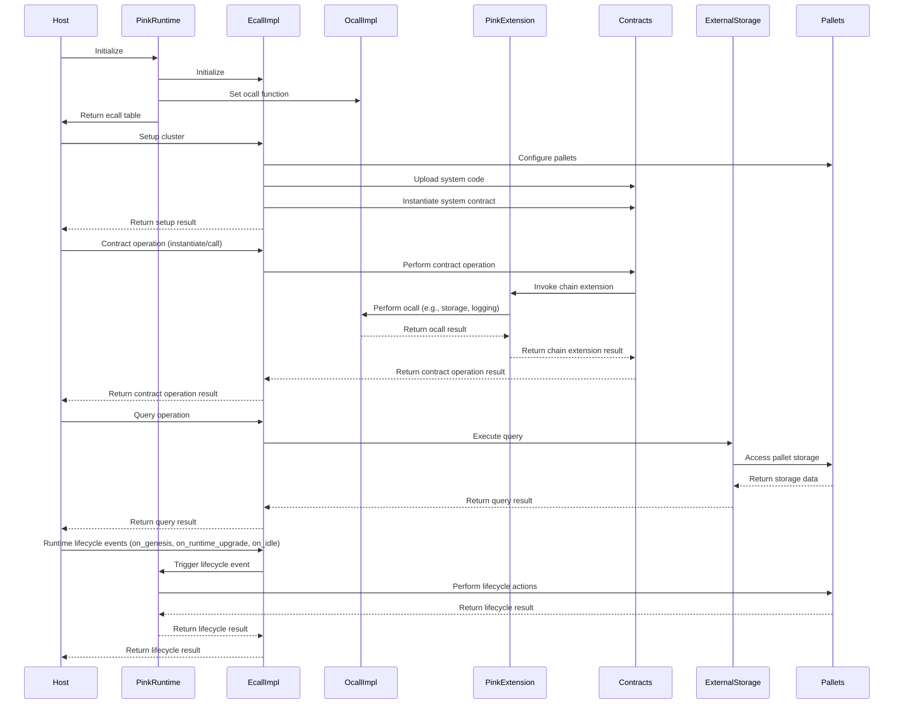

| Serial No. | Topic                                           |
|------------|-------------------------------------------------|
| 01        | Overview                                         |
| 02        | Architecture view (Sequence Diagram)             |
| 03        | Protocol Roles                                   |
| 04        | Approach Taken in auditing Phat Contract Runtime |
| 05        | Contract Analysis                                |
| 06        | Codebase Quality (Table)                         |
| 07        | Centralization Risks                             |
| 08        | Systematic Risks                                 |
| 09        | Architectural Improvement                        |
| 10        | Time spent                                       |


# Overview

The Pink runtime is a powerful and flexible execution environment for smart contracts on the Phala Network. It is built on top of Substrate's `pallet-contracts` and provides a range of custom chain extensions and features to enhance the capabilities of smart contracts. The Pink runtime enables developers to create decentralized applications (dApps) with advanced functionalities, such as cross-chain interoperability, off-chain data access, and complex computation.

One of the key features of the Pink runtime is its ability to execute smart contracts in a trustless and verifiable manner. It achieves this by leveraging the security and isolation provided by the Phala Network's off-chain workers, which run in Trusted Execution Environments (TEEs). This ensures that the execution of smart contracts is protected from tampering and unauthorized access.

The Pink runtime introduces the concept of "Phat Contracts," which are smart contracts that can perform complex computations and access off-chain data sources. Phat Contracts can interact with external APIs, databases, and other blockchain networks, enabling a wide range of use cases and integrations. For example, a Phat Contract can retrieve real-time market data from an external API and use it to trigger automated actions within the contract.

```rust
fn http_request(&self, request: HttpRequest) -> Result<HttpResponse, Self::Error> {
    // Perform an HTTP request to an external API
    // Process the response and trigger actions based on the data
}
```

The runtime provides a set of chain extensions that expand the functionality of smart contracts. These extensions include:

- `HttpRequest` and `HttpResponse`: Allows contracts to make HTTP requests to external APIs and handle the responses.
- `Signing` and `Verification`: Enables contracts to sign messages and verify signatures using different cryptographic schemes (e.g., Sr25519, Ed25519, ECDSA).
- `KeyDerivation`: Provides key derivation functionality for generating unique keys based on a contract's address and a salt.
- `Logging`: Allows contracts to log messages at different levels (e.g., error, warn, info, debug, trace).
- `RandomnessGeneration`: Generates secure random numbers for use within contracts.
- `CacheStorage`: Provides a key-value cache storage for contracts to store and retrieve data efficiently.

These chain extensions are implemented in the `PinkExtension` struct and can be accessed by contracts through the `PinkExtBackend` trait.

```rust
impl PinkExtBackend for DefaultPinkExtension<'_, T, E> {
    fn http_request(&self, request: HttpRequest) -> Result<HttpResponse, Self::Error> {
        // Implement the HTTP request functionality
    }

    fn sign(&self, sigtype: SigType, key: Cow<[u8]>, message: Cow<[u8]>) -> Result<Vec<u8>, Self::Error> {
        // Implement the signing functionality
    }

    fn cache_set(&self, key: Cow<[u8]>, value: Cow<[u8]>) -> Result<Result<(), StorageQuotaExceeded>, Self::Error> {
        // Implement the cache set functionality
    }

    // Other chain extension functions
}
```

The Pink runtime also provides a local key-value cache (`LocalCache`) that allows contracts to store and retrieve data efficiently. The cache supports features like expiration times, storage quotas, and garbage collection. This local cache enables contracts to perform complex computations and store intermediate results without the need for expensive storage operations on the blockchain.

```rust
pub struct LocalCache {
    // Local key-value cache implementation
}

impl LocalCache {
    pub fn set(&mut self, id: Cow<[u8]>, key: Cow<[u8]>, value: Cow<[u8]>) -> Result<(), StorageQuotaExceeded> {
        // Set a value in the cache
    }

    pub fn get(&self, id: &[u8], key: &[u8]) -> Option<Vec<u8>> {
        // Get a value from the cache
    }

    // Other cache operations
}
```

The Pink runtime integrates with the Substrate framework and utilizes its pallet system. It defines custom pallets, such as the `PinkPallet`, which handles the configuration and management of the Pink runtime. The runtime also interacts with other pallets, such as `Balances` and `Contracts`, to facilitate the execution and management of smart contracts.


# Architecture view (Sequence Diagram):
If the sequence diagram is not visible or showing mermaid code of that diagram, please [CLICK HERE](https://mermaid.live/edit#pako:eNqNVduO2jAQ_RXLT1TKUi67AfKwUtUilSfo0r5USCvXGbIWxs76sloW8e-1yY1coM1TnDnHM-fMxD5iKmPAEdbwakFQ-MZIosh-I5B7UqIMoywlwqDvUpv21xUTuycrDNtDOzinhPPFPuXt0PJ6yG85fzcgNJOiHf4qhVGEGt2Rz7GUIHxtpCJJR0ErlxQ8Mwt5SXePjxcaIrQQzDDC2UdOvwg6aKnoX8BlBVyDQdIv0dYKakpRdYKvJUJPYKwSCM5wQ_5waNQ6r-1rU0S51U51BiqjXlWmNfKGbVliFTgrcvlNbOlphH6lXJIY6YPbdY_8cNyEL4Q2zllGDFScLNrkNUXqc_0KtOXmusoiF5IpKOLdQz1WJf3skZ9ulrgCtZWqqqvaKaOV0HwUytnz6t7kDhB9Icw1pT6TNWi940XGrOs96Cf9AOlsKAPEZZIwkeRFLy_9aaTPjcq2KYxq567LzUmNmmv0SnHd64LatvySfb2jN4jX2vvDgjo0O3LZyMY_HbmfHKh10_bqmTm-jrkc_i-Ugtb55Bc9yE3MMHddSYoRzdYoJoZ0p-o08Fzaf3pWx16zKT8nEGdboAfKAcEbCKNRT4rnBARopgPk3lUGfLapO8VjOH9jMYeOX6R27P1ULElANRN0nVSlt8WYVxxyPt50y99aqlx4xWpOdpGq09tu2nV_m3gc4D2oPWGxu_SOnr3B5gXc9YUj9xoTtdvgjTg5HLFGrg-C4sgoCwG2qZuD4oIsPrp75beUbrklXGdrHB3xO45Go_t-OBvPxtPBbBoOp2GADzgaD_thOBhNhvcjF5w8DE8B_jhvMOg71EM4CF1wHI7Gg8npLyvXpsQ)




# Protocol Roles:

The Pink runtime involves several key roles and actors that interact with each other to facilitate the execution and management of smart contracts. Let's explore these roles and their activities in detail.

1. **Host**:
   The host is the external entity that interacts with the Pink runtime. It is responsible for initializing the runtime, setting up the cluster configuration, and triggering contract operations. The host communicates with the runtime through the defined ecall functions.

   Example:
   ```rust
   #[no_mangle]
   pub unsafe extern "C" fn __pink_runtime_init(
       config: *const config_t,
       ecalls: *mut ecalls_t,
   ) -> ::core::ffi::c_int {
       // Initialize the Pink runtime
   }
   ```

2. **Pink Runtime**:
   The Pink runtime is the core component that manages the execution of smart contracts. It initializes the ecall and ocall implementations, handles the setup of the cluster configuration, and processes contract operations. The runtime interacts with the pallets and the external storage to access and modify the state.

   Example:
   ```rust
   pub fn on_runtime_upgrade() {
       use frame_support::traits::OnRuntimeUpgrade;
       type Migrations = (Migration<PinkRuntime>, AllPalletsWithSystem);
       Migrations::on_runtime_upgrade();
       info!("Runtime database migration done");
   }
   ```

3. **Ecall Implementation (EcallImpl)**:
   The ecall implementation is responsible for handling the external calls (ecalls) from the host to the Pink runtime. It defines the functions that can be invoked by the host, such as `setup`, `contract_instantiate`, `contract_call`, and query operations. The ecall implementation interacts with the contracts, pallets, and external storage to perform the requested operations.

   Example:
   ```rust
   impl ecall::ECalls for ECallImpl {
       fn contract_instantiate(
           &mut self,
           code_hash: Hash,
           input_data: Vec<u8>,
           salt: Vec<u8>,
           mode: ExecutionMode,
           tx_args: TransactionArguments,
       ) -> Vec<u8> {
           // Instantiate a contract
       }
   }
   ```

4. **Ocall Implementation (OcallImpl)**:
   The ocall implementation handles the outward calls (ocalls) from the Pink runtime to the host. It provides functions for storage operations, logging, side effect emission, cache management, and HTTP requests. The ocall implementation acts as an intermediary between the runtime and the host, allowing the runtime to interact with external resources.

   Example:
   ```rust
   impl CrossCall for OCallImpl {
       fn cross_call(&self, id: u32, data: &[u8]) -> Vec<u8> {
           // Perform a cross-call from the runtime to the host
       }
   }
   ```

5. **Pink Extension (PinkExtension)**:
   The Pink extension is responsible for handling the chain extension functionality in the runtime. It processes the extension calls made by the contracts and dispatches them to the appropriate functions based on the `func_id`. The Pink extension interacts with the ocall implementation to perform external operations, such as HTTP requests and cache management.

   Example:
   ```rust
   impl ChainExtension<PinkRuntime> for PinkExtension {
       fn call<E: Ext<T = PinkRuntime>>(
           &mut self,
           env: Environment<E, InitState>,
       ) -> ExtResult<RetVal> {
           // Handle the chain extension call
       }
   }
   ```

6. **Contracts**:
   Contracts are the smart contracts that are deployed and executed on the Pink runtime. They can be instantiated and invoked by the host through the ecall functions. Contracts can interact with the Pink extension to access chain extension functionality, such as HTTP requests and cache storage.

   Example:
   ```rust
   #[ink::contract]
   mod my_contract {
       #[ink(storage)]
       pub struct MyContract { /* ... */ }

       impl MyContract {
           #[ink(constructor)]
           pub fn new() -> Self { /* ... */ }

           #[ink(message)]
           pub fn my_function(&self) { /* ... */ }
       }
   }
   ```

7. **External Storage (ExternalStorage)**:
   The external storage is responsible for managing the storage of the Pink runtime. It provides an interface to access and modify the storage state. The external storage interacts with the pallets to retrieve and update the storage data.

   Example:
   ```rust
   impl<Backend> Storage<Backend>
   where
       Backend: StorageBackend<Hashing> + CommitTransaction + AsTrieBackend<Hashing>,
   {
       pub fn execute_mut<R>(
           &mut self,
           context: &ExecContext,
           f: impl FnOnce() -> R,
       ) -> (R, ExecSideEffects) {
           // Execute a storage mutation operation
       }
   }
   ```

8. **Pallets**:
   Pallets are the modular components of the Substrate runtime that encapsulate specific functionality. The Pink runtime interacts with various pallets, such as `PinkPallet`, `Balances`, and `Contracts`, to manage the runtime configuration, handle balance transfers, and execute smart contracts.

   Example:
   ```rust
   #[pallet::call]
   impl<T: Config> Pallet<T> {
       #[pallet::weight(0)]
       pub fn set_gas_price(origin: OriginFor<T>, price: BalanceOf<T>) -> DispatchResult {
           ensure_root(origin)?;
           <GasPrice<T>>::put(price);
           Ok(())
       }
   }
   ```

These roles and actors work together to enable the execution and management of smart contracts in the Pink runtime. The host interacts with the runtime through ecalls, while the runtime communicates with the host through ocalls. The ecall and ocall implementations handle the communication between the host and the runtime. The Pink extension provides chain extension functionality to the contracts, allowing them to access external resources. The external storage manages the storage state, and the pallets encapsulate specific runtime functionality.


# Approach Taken in auditing Phat Contract Runtime


The approach I took for auditing the Pink runtime consisted of several stages, each focusing on a specific aspect of the codebase and its functionality. Here's a detailed breakdown of my approach:

1. Documentation Review and High-Level Code Read (Day 1-3):
   I started by thoroughly reading the Pink runtime documentation, including the whitepaper and any available technical specifications. This helped me gain a high-level understanding of the Pink runtime's architecture, key features, and intended functionality. I also performed a high-level read of the codebase to familiarize myself with the overall structure and organization of the project.

   During this phase, I focused on understanding the core concepts, such as the role of the host, Pink runtime, ecall and ocall implementations, Pink extension, contracts, external storage, and pallets. I paid attention to how these components interact with each other and the flow of data and control throughout the system.

2. Sequence Diagram Creation (Day 4-5):
   To better visualize the interactions and flow of the Pink runtime, I created sequence diagrams for each actor and role identified in the previous step. These diagrams helped me understand the communication patterns, function invocations, and data flow between the different components.

   I used the Mermaid syntax to create the sequence diagrams, which allowed me to clearly represent the interactions between the host, Pink runtime, ecall and ocall implementations, Pink extension, contracts, external storage, and pallets. By drawing everything out, I gained a clearer picture of how the various parts of the system work together to execute smart contracts and manage the runtime state.

3. Line-by-Line Code Review (Day 6-9):
   With a solid understanding of the overall architecture and flow, I proceeded to perform a detailed line-by-line review of the codebase. I went through each contract, module, and function, carefully examining the code logic, data structures, and interactions.

   During this phase, I paid close attention to the implementation details of key components, such as the `EcallImpl`, `OcallImpl`, `PinkExtension`, and `ExternalStorage`. I analyzed how these components handle various operations, such as contract instantiation, contract calls, chain extensions, storage management, and pallet interactions.

   I also reviewed the implementation of the `LocalCache` and its associated functions, ensuring that the caching mechanism was properly implemented and free from any potential bugs or vulnerabilities.

4. Review and Question Resolution (Day 10-12):
   After completing the line-by-line code review, I revisited all the notes and questions I had accumulated during the previous stages. I systematically went through each point, referring back to the codebase and documentation to clarify any uncertainties or ambiguities.

   I paid special attention to areas that required further investigation, such as complex logic, edge cases, and potential security vulnerabilities. I made sure to thoroughly understand the reasoning behind each design decision and how it impacted the overall functionality and security of the Pink runtime.

5. Testing and Functionality Verification (Day 13-14):
   To validate the correctness and robustness of the Pink runtime, I conducted extensive testing and explored different execution paths. I created test cases to cover various scenarios, including normal usage, edge cases, and potential error conditions.

   I tested the functionality of key components, such as contract instantiation, contract calls, chain extensions, storage operations, and pallet interactions. I verified that the expected behavior was observed and that the runtime handled different inputs and conditions correctly.

6. Security Testing and Vulnerability Assessment (Day 15-18):
   In this phase, I focused on identifying any potential security vulnerabilities or weaknesses in the Pink runtime. I attempted to break the system by testing various attack vectors, such as input validation, error handling, and resource management.

   I paid close attention to the security implications of the chain extensions, ensuring that they were properly sandboxed and did not introduce any unintended risks. I also reviewed the cryptographic operations, such as signing and verification, to ensure they were implemented securely.

   Additionally, I tested the runtime's behavior under different execution modes (`Query`, `Estimating`, `Transaction`) to verify that the appropriate restrictions and safeguards were in place.

7. Findings Documentation and Analysis Report (Day 19-21):
   Finally, I compiled all my findings, observations, and recommendations into a comprehensive analysis report. I documented any bugs, vulnerabilities, or areas for improvement discovered during the audit process.

   For each finding, I provided a detailed description of the issue, its potential impact on the system, and recommendations for mitigation or resolution. I also highlighted the strengths and positive aspects of the Pink runtime, acknowledging the well-designed components and security measures in place.

   Throughout the report, I referenced specific code snippets and documentation to support my findings and provide clear examples. I aimed to present the information in a clear and concise manner, making it easy for the development team to understand and address the identified issues.

By following this systematic approach, I was able to thoroughly audit the Pink runtime, identify potential issues, and provide valuable insights and recommendations for improving its security, functionality, and overall robustness.


# Contract Analysis:

Here I will explain every contracts and their's key functionalities one by one with how thery works:

## Contract 1: runtime/src/runtime.rs

It defines the `PinkRuntime` struct using the `construct_runtime!` macro, which includes various pallets such as `System`, `Timestamp`, `Balances`, `Randomness`, `Contracts`, and `Pink`. The code also sets up the necessary types, parameters, and configurations for each pallet. Additionally, it provides functions for handling runtime upgrades, on-genesis actions, and on-idle events.

**Key Function's Functionality:**

   a. `construct_runtime!` macro:
      This macro is used to define the `PinkRuntime` struct, which represents the Substrate runtime for the Pink network. It takes the pallets and their configurations as input and generates the necessary code to wire them together.
```rust
      frame_support::construct_runtime! {
          pub struct PinkRuntime {
              System: frame_system,
              Timestamp: pallet_timestamp,
              Balances: pallet_balances,
              Randomness: pallet_insecure_randomness_collective_flip,
              Contracts: pallet_contracts,
              Pink: pallet_pink,
          }
      }
```

   b. `on_genesis` function:
      This function is called during the genesis block creation of the Pink network. It invokes the `on_genesis` method for all the pallets defined in the runtime, allowing them to perform any necessary initialization tasks.
```rust
      pub fn on_genesis() {
          <AllPalletsWithSystem as frame_support::traits::OnGenesis>::on_genesis();
      }
```

   c. `on_runtime_upgrade` function:
      This function is called when a runtime upgrade occurs. It executes the necessary migrations for the runtime by invoking the `on_runtime_upgrade` method of the `Migrations` type, which includes the `Migration<PinkRuntime>` and `AllPalletsWithSystem`.
```rust
      pub fn on_runtime_upgrade() {
          use frame_support::traits::OnRuntimeUpgrade;
          type Migrations = (Migration<PinkRuntime>, AllPalletsWithSystem);
          Migrations::on_runtime_upgrade();
          info!("Runtime database migration done");
      }
```

   d. `on_idle` function:
      This function is called periodically during the idle time of the Pink network. It invokes the `on_idle` method for all the pallets defined in the runtime, allowing them to perform any necessary tasks during idle periods.
```rust
      pub fn on_idle(n: BlockNumber) {
          <AllPalletsWithSystem as frame_support::traits::OnIdle<BlockNumber>>::on_idle(n, Weight::MAX);
      }
```

   These key functions play crucial roles in setting up and managing the Substrate runtime for the Pink network, ensuring proper initialization, handling runtime upgrades, and executing necessary tasks during idle periods.


## Contarct 2: runtime/src/contract.rs

This  provides APIs for instantiating and calling contracts within the Pink network. It defines functions such as `instantiate` and `bare_call` to interact with the `pallet_contracts` module. The contract also includes utility functions for masking low bits of numbers, coarse-graining gas and storage deposits, and checking instantiation results. It leverages the `TransactionArguments` struct from the `pink_capi` module to handle transaction-related parameters.

**Key Function's Functionality:**

   a. `instantiate` function:
      This function instantiates a contract with the given code hash and input data. It takes the execution mode and transaction arguments as input and calls the `bare_instantiate` function from the `pallet_contracts` module. The function returns the instantiation result, which includes the gas consumed, storage deposit, and events.
```rust
      pub fn instantiate(
          code_hash: Hash,
          input_data: Vec<u8>,
          salt: Vec<u8>,
          mode: ExecutionMode,
          args: TransactionArguments,
      ) -> ContractInstantiateResult {
          // ...
      }
```

   b. `bare_call` function:
      This function calls a contract method with the given address and input data. It takes the execution mode and transaction arguments as input and invokes the `bare_call` function from the `pallet_contracts` module. The function returns the execution result, including the gas consumed, storage deposit, and events.
```rust
      pub fn bare_call(
          address: AccountId,
          input_data: Vec<u8>,
          mode: ExecutionMode,
          tx_args: TransactionArguments,
      ) -> ContractExecResult {
          // ...
      }
```

   c. `mask_low_bits64` and `mask_low_bits128` functions:
      These functions mask the lowest bits of a given number. They take a number and the minimum number of bits to mask as input and return the masked value. The masking is performed by finding the most significant bit position and creating a mask based on that position.
```rust
      define_mask_fn!(mask_low_bits64, 64, u64);
      define_mask_fn!(mask_low_bits128, 128, u128);
```

   d. `coarse_grained` function:
      This function performs coarse-graining on the gas consumed, gas required, and storage deposit of a contract result. It masks the gas values using the `mask_gas` function and the storage deposit using the `mask_deposit` function. The coarse-grained result is returned.
```rust
      fn coarse_grained<T>(mut result: ContractResult<T>, deposit_per_byte: u128) -> ContractResult<T> {
          // ...
      }
```

   These key functions provide the necessary functionality for instantiating and calling contracts within the Pink network. They handle the interaction with the `pallet_contracts` module, manage gas and storage deposits, and perform coarse-graining when required.


## Contarct 3: runtime/src/storage/mod.rs

It provides an abstract storage provider for the runtime. It defines the `Storage` struct, which wraps a backend storage implementation. The contract includes methods for executing code segments within the context of the storage backend, committing changes to the backend, and retrieving storage values. It also defines the `CommitTransaction` trait for committing transactions to the storage backend. Additionally, the contract includes functionality for emitting system event blocks.

**Key Function's Functionality:**

   a. `execute_with` function:
      This function executes a specified code segment within the context of the storage backend. It takes an `ExecContext` and a closure `f` as input. It creates an `OverlayedChanges` instance, starts a transaction, and executes the closure within the configured context. It returns a tuple containing the result of the closure, the execution side effects, and the overlayed changes.
```rust
      pub fn execute_with<R>(
          &self,
          exec_context: &ExecContext,
          f: impl FnOnce() -> R,
      ) -> (R, ExecSideEffects, OverlayedChanges<Hashing>) {
          // ...
      }
```

   b. `execute_mut` function:
      This function is similar to `execute_with`, but it also commits the storage changes to the backend. It takes an `ExecContext` and a closure `f` as input. It calls `execute_with` internally and then commits the changes using the `commit_changes` method. It returns a tuple containing the result of the closure and the execution side effects.
```rust
      pub fn execute_mut<R>(
          &mut self,
          context: &ExecContext,
          f: impl FnOnce() -> R,
      ) -> (R, ExecSideEffects) {
          // ...
      }
```

   c. `commit_changes` function:
      This function commits the storage changes to the backend. It takes an `OverlayedChanges` instance as input. It converts the changes into a backend transaction using the `changes_transaction` method and then commits the transaction using the `commit_transaction` method of the backend.
```rust
      pub fn commit_changes(&mut self, changes: OverlayedChanges<Hashing>) {
          let (root, transaction) = self.changes_transaction(changes);
          self.backend.commit_transaction(root, transaction)
      }
```

   d. `maybe_emit_system_event_block` function:
      This function handles the emission of substrate runtime events. It takes a `SystemEvents` instance as input. If the events are not empty and the execution mode is a transaction, it creates an `EventsBlockBody` and an `EventsBlockHeader`. It then sets the last event block hash in the `PalletPink` and emits the system event block using the `OCallImpl`.
```rust
      pub fn maybe_emit_system_event_block(events: SystemEvents) {
          // ...
      }
```

   These key functions provide the core functionality for managing storage, executing code within the storage context, committing changes, and emitting system event blocks. They abstract away the complexities of working with the storage backend and provide a convenient interface for interacting with the storage in the runtime.


## Contarct 4: runtime/src/storage/external_backend.rs

It provides a storage provider for the runtime using an external database (`ExternalDB`). The `ExternalDB` implements the `TrieBackendStorage` trait, which is required for the `TrieBackend`. Instead of managing the key-value backend itself, it delegates the key-value reads and writes to the host via ocalls. The contract defines the `ExternalBackend` type as a `TrieBackend` with `ExternalDB` and `Hashing`, and the `ExternalStorage` type as a `Storage` with `ExternalBackend`.

**Key Function's Functionality:**

   a. `get` function (in `impl TrieBackendStorage<Hashing> for ExternalDB`):
      This function is implemented for the `TrieBackendStorage` trait. It retrieves the value associated with a given key from the external storage. It delegates the storage retrieval to the host via the `storage_get` ocall provided by `OCallImpl`.
```rust
      fn get(&self, key: &Hash, _prefix: Prefix) -> Result<Option<DBValue>, DefaultError> {
          Ok(OCallImpl.storage_get(key.as_ref().to_vec()))
      }
```

   b. `commit_transaction` function (in `impl CommitTransaction for ExternalBackend`):
      This function commits a transaction to the external storage backend. It drains the changes from the transaction, converts the keys to the appropriate format, and collects them into a vector. It then calls the `storage_commit` ocall provided by `OCallImpl` to commit the changes to the external storage.
```rust
      fn commit_transaction(&mut self, root: Hash, mut transaction: BackendTransaction<Hashing>) {
          let changes = transaction
              .drain()
              .into_iter()
              .map(|(k, v)| (k[k.len() - 32..].to_vec(), v))
              .collect();
          OCallImpl.storage_commit(root, changes)
      }
```

   c. `instantiate` function (in `impl ExternalStorage`):
      This function instantiates a new `ExternalStorage` instance. It retrieves the storage root hash from the host using the `storage_root` ocall provided by `OCallImpl`. If the root is not found, it uses an empty trie root. It then creates a new `TrieBackend` using the `ExternalDB` and the root hash, and returns a new `ExternalStorage` instance with the backend.
```rust
      pub fn instantiate() -> Self {
          let root = OCallImpl
              .storage_root()
              .unwrap_or_else(sp_trie::empty_trie_root::<sp_state_machine::LayoutV1<Hashing>>);
          let backend = TrieBackendBuilder::new(ExternalDB, root).build();
          crate::storage::Storage::new(backend)
      }
```

   d. `code_exists` function (in `pub mod helper`):
      This function checks the existence of a particular ink code in the storage. It takes a code hash as input and constructs the corresponding code owner key using the `code_owner_key` function. It then instantiates an `ExternalStorage` instance and checks if the key exists in the storage using the `get` method.
```rust
      pub fn code_exists(code_hash: &Hash) -> bool {
          let key = code_owner_key(code_hash);
          super::ExternalStorage::instantiate().get(&key).is_some()
      }
```

   These key functions provide the necessary functionality for interacting with the external storage backend. They handle storage retrieval, transaction committing, storage instantiation, and checking the existence of ink code in the storage. The contract leverages ocalls to delegate the actual storage operations to the host.


## Contarct 5: runtime/src/runtime/pallet_pink.rs

It defines a pallet named `Pallet<T>` that is used to store custom configuration of the runtime. It includes storage items such as `ClusterId`, `GasPrice`, `DepositPerByte`, `DepositPerItem`, `TreasuryAccount`, `Key`, `SidevmCodes`, `SystemContract`, `NextEventBlockNumber`, and `LastEventBlockHash`. The pallet also defines errors, types, and implements the `AddressGenerator` trait for generating contract addresses. It provides functions for setting and retrieving various configuration values.

**Key Function's Functionality:**

   a. `contract_address` function (in `impl<T: Config + pallet_contracts::Config> AddressGenerator<T> for Pallet<T>`):
      This function generates a contract address based on the deploying address, code hash, and salt. It combines these components along with the cluster ID to create a unique preimage and then hashes it to obtain the contract address.
```rust
      fn contract_address(
          deploying_address: &AccountIdOf<T>,
          code_hash: &HashOf<T>,
          _input_data: &[u8],
          salt: &[u8],
      ) -> AccountIdOf<T> {
          // ...
      }
```

   b. `put_sidevm_code` function:
      This function allows the owner to store a Sidevm code in the pallet's storage. It calculates the storage fee based on the code size and the deposit per byte and item. It then inserts the code into the `SidevmCodes` storage map with the code hash as the key.
```rust
      pub fn put_sidevm_code(
          owner: T::AccountId,
          code: Vec<u8>,
      ) -> Result<T::Hash, DispatchError> {
          // ...
      }
```

   c. `pay_for_gas` and `refund_gas` functions:
      These functions handle the payment and refund of gas fees. The `pay_for_gas` function transfers the gas fee from the user's account to the treasury account, while the `refund_gas` function transfers the unused gas fee back to the user's account.
```rust
      pub fn pay_for_gas(user: &T::AccountId, gas: Weight) -> DispatchResult {
          Self::pay(user, Self::convert(gas))
      }

      pub fn refund_gas(user: &T::AccountId, gas: Weight) -> DispatchResult {
          Self::refund(user, Self::convert(gas))
      }
```

   d. Configuration setter functions:
      The pallet provides various functions to set configuration values, such as `set_cluster_id`, `set_key`, `set_system_contract`, `set_gas_price`, `set_deposit_per_item`, `set_deposit_per_byte`, `set_treasury_account`, and `set_last_event_block_hash`. These functions allow the runtime to update the corresponding storage values.
```rust
      pub fn set_cluster_id(cluster_id: Hash) {
          <ClusterId<T>>::put(cluster_id);
      }

      pub fn set_key(key: Sr25519SecretKey) {
          <Key<T>>::put(key);
      }
      // ...
```

   These key functions provide the core functionality for managing the custom configuration of the runtime. They handle contract address generation, storing Sidevm codes, managing gas fees, and setting various configuration values. The pallet acts as a central storage for the runtime's custom settings and provides a convenient interface for accessing and modifying them.


## Contarct 6: runtime/src/capi/mod.rs

It serves as the entrypoint of the `libpink.so` library and provides FFI (Foreign Function Interface) helpers to bridge the cross-library boundary. It defines an initialization function `__pink_runtime_init` that is called to initialize the runtime and fill the ecalls table. The contract also includes an `ecall` function that acts as a central hub for routing function calls to the appropriate implementation based on the provided `call_id`. The contract utilizes the `pink_capi` library for interacting with the runtime environment.

**Key Function's Functionality:**

   a. `__pink_runtime_init` function:
      This function is the entry point of the runtime. It takes a pointer to the runtime configuration (`config`) and a mutable pointer to the ecalls table (`ecalls`). It initializes the runtime by setting the ocall function using `ocall_impl::set_ocall_fn` and populates the ecalls table with the `ecall` and `get_version` functions. It also initializes the logger if the runtime is running as a dynamic library.
```rust
      #[no_mangle]
      pub unsafe extern "C" fn __pink_runtime_init(
          config: *const config_t,
          ecalls: *mut ecalls_t,
      ) -> ::core::ffi::c_int {
          // ...
      }
```

   b. `ecall` function:
      This function serves as the central hub for all 'ecall' functions. It takes the `call_id`, input data pointer (`data`), input data length (`len`), context pointer (`ctx`), and an output function pointer (`output_fn`). It dispatches the function call to the appropriate implementation based on the `call_id` using `ecall::dispatch`. The function then invokes the `output_fn` with the encoded return value.
```rust
      unsafe extern "C" fn ecall(
          call_id: u32,
          data: *const u8,
          len: usize,
          ctx: *mut ::core::ffi::c_void,
          output_fn: output_fn_t,
      ) {
          // ...
      }
```

   c. `get_version` function:
      This function is an unsafe extern "C" function that retrieves the version of the runtime. It takes mutable pointers to `major` and `minor` version numbers and assigns them the values obtained from `crate::version()`.
```rust
      unsafe extern "C" fn get_version(major: *mut u32, minor: *mut u32) {
          let ver = crate::version();
          *major = ver.0;
          *minor = ver.1;
      }
```

   These key functions form the core of the FFI interface between the `libpink.so` library and the runtime environment. The `__pink_runtime_init` function initializes the runtime and sets up the necessary callbacks, while the `ecall` function handles the dispatching of function calls to the appropriate implementations. The `get_version` function allows retrieving the version of the runtime.

   The contract also includes modules `ecall_impl` and `ocall_impl` for implementing the actual ecall and ocall functionality, respectively.


## Contarct 7: runtime/src/capi/ecall_impl.rs

It provides support for enterward cross-boundary calls. It defines the `ECallImpl` struct, which implements the `ecall::ECalls` trait from the `pink_capi` library. The contract includes various functions for cluster setup, code uploading, contract instantiation and calling, and retrieving information about accounts and contracts. It also provides functions for handling runtime events such as `on_genesis`, `on_runtime_upgrade`, and `on_idle`. The contract interacts with the runtime pallets and utilities from the `crate::runtime` module.

**Key Function's Functionality:**

   a. `setup` function:
      This function is called during the cluster setup process. It takes a `ClusterSetupConfig` as input and initializes the runtime by setting various configuration values such as the cluster ID, gas price, deposit amounts, and treasury account. It also uploads the system code and deploys the system contract.
```rust
      fn setup(&mut self, config: ClusterSetupConfig) -> Result<(), String> {
          // ...
      }
```

   b. `upload_code` function:
      This function allows uploading contract code to the runtime. It takes the account, code bytes, and a determinism flag as input. It checks the code size against the maximum allowed size and uploads the code using the `Contracts::bare_upload_code` function. It returns the code hash if successful.
```rust
      fn upload_code(
          &mut self,
          account: AccountId,
          code: Vec<u8>,
          deterministic: bool,
      ) -> Result<Hash, String> {
          // ...
      }
```

   c. `contract_instantiate` function:
      This function instantiates a contract with the given code hash, input data, salt, execution mode, and transaction arguments. It handles the contract instantiation process, including address generation, instantiation call, and logging. It returns the encoded result of the instantiation.
```rust
      fn contract_instantiate(
          &mut self,
          code_hash: Hash,
          input_data: Vec<u8>,
          salt: Vec<u8>,
          mode: ExecutionMode,
          tx_args: TransactionArguments,
      ) -> Vec<u8> {
          // ...
      }
```

   d. `contract_call` function:
      This function performs a contract call with the given contract address, input data, execution mode, and transaction arguments. It handles the contract call process, including sanitizing the arguments, handling deposits, and executing the call. It returns the encoded result of the contract call.
```rust
      fn contract_call(
          &mut self,
          address: AccountId,
          input_data: Vec<u8>,
          mode: ExecutionMode,
          tx_args: TransactionArguments,
      ) -> Vec<u8> {
          // ...
      }
```

   These key functions provide the core functionality for enterward cross-boundary calls. The `setup` function handles the initial cluster setup, while the `upload_code` function allows uploading contract code. The `contract_instantiate` and `contract_call` functions facilitate contract instantiation and calling, respectively. The contract also includes various utility functions for retrieving information about accounts, balances, and contracts, as well as handling runtime events.


## Contarct 8: runtime/src/capi/ocall_impl.rs

It provides low-level support for outward cross-boundary calls. It defines the `OCallImpl` struct, which implements the `CrossCallMut`, `CrossCall`, and `OCall` traits from the `pink_capi` library. The contract includes a static `OCALL` variable of type `InnerType<cross_call_fn_t>` that stores the ocall function pointer. It also provides a `set_ocall_fn` function to set the ocall function and optionally the allocation and deallocation functions. The contract includes an optional `allocator` module that acts as a global allocator and delegates memory allocation and deallocation to the main executable's allocator.

**Key Function's Functionality:**

   a. `set_ocall_fn` function:
      This function is used to set the ocall function pointer and optionally the allocation and deallocation function pointers. It takes an `ocalls_t` struct as input, which contains the function pointers. If the ocall function is not provided, it returns an error. It updates the `OCALL` static variable with the provided ocall function pointer and optionally sets the allocation and deallocation function pointers in the `allocator` module.
```rust
      pub(super) fn set_ocall_fn(ocalls: ocalls_t) -> Result<(), &'static str> {
          // ...
      }
```

   b. `cross_call` function (in `impl CrossCall for OCallImpl`):
      This function performs a cross-boundary call using the stored ocall function pointer. It takes a call ID and data as input. It defines an unsafe `output_fn` function that extends the output vector with the returned data. It then calls the `OCALL` function pointer with the provided call ID, data, and the `output_fn` as the output function. The function returns the output vector containing the result of the cross-boundary call.
```rust
      fn cross_call(&self, id: u32, data: &[u8]) -> Vec<u8> {
          unsafe extern "C" fn output_fn(ctx: *mut ::core::ffi::c_void, data: *const u8, len: usize) {
              // ...
          }
          unsafe {
              // ...
              OCALL(id, data.as_ptr(), data.len(), ctx, Some(output_fn));
              output
          }
      }
```

   c. `cross_call_mut` function (in `impl CrossCallMut for OCallImpl`):
      This function is similar to the `cross_call` function but is intended for mutable cross-boundary calls. It simply delegates the call to the `cross_call` function.
```rust
      fn cross_call_mut(&mut self, call_id: u32, data: &[u8]) -> Vec<u8> {
          self.cross_call(call_id, data)
      }
```

   d. `allocator` module:
      This optional module acts as a global allocator for the Rust runtime. It defines the `PinkAllocator` struct, which implements the `GlobalAlloc` trait. The allocator delegates memory allocation and deallocation to the main executable's allocator using the `ALLOC_FUNC` and `DEALLOC_FUNC` function pointers. The module also includes static variables `ALLOC_FUNC` and `DEALLOC_FUNC` that store the allocation and deallocation function pointers, respectively.
```rust
      #[cfg(feature = "allocator")]
      mod allocator {
          // ...
      }
```

   These key functions provide the necessary functionality for outward cross-boundary calls. The `set_ocall_fn` function allows setting the ocall function pointer, while the `cross_call` and `cross_call_mut` functions perform the actual cross-boundary calls. The optional `allocator` module acts as a global allocator and delegates memory management to the main executable's allocator.


## Contarct 9: runtime/src/runtime/extension.rs

It provides the chain extension implementation for the Pink runtime, inheriting from the `pink-chain-extension` crate with some overwrites. It defines the `PinkExtension` struct, which implements the `ChainExtension` trait for the `PinkRuntime`. The contract also includes the `CallInQuery` and `CallInCommand` structs, which implement the `PinkExtBackend` trait for handling extension calls in query and command modes, respectively. The contract interacts with the runtime pallets and modules to perform various operations related to contracts, balances, and events.

**Key Function's Functionality:**

   a. `call` function (in `impl ChainExtension<PinkRuntime> for PinkExtension`):
      This function is called when a contract invokes a chain extension. It takes an `Environment` as input and returns a `Result<RetVal>`. It checks the extension ID and function ID to determine the appropriate action to take. It dispatches the extension call using the `dispatch_ext_call!` macro based on the execution mode (query or command). It writes the output to the environment buffer and returns the result.
```rust
      fn call<E: Ext<T = PinkRuntime>>(
          &mut self,
          env: Environment<E, InitState>,
      ) -> ExtResult<RetVal> {
          // ...
      }
```

   b. `http_request` function (in `impl PinkExtBackend for CallInQuery` and `impl PinkExtBackend for CallInCommand`):
      This function handles HTTP requests made by contracts. In the `CallInQuery` implementation, it delegates the request to the `OCallImpl.http_request` function. In the `CallInCommand` implementation, it returns an error indicating that HTTP requests are not supported in transactions.
```rust
      fn http_request(&self, request: HttpRequest) -> Result<HttpResponse, Self::Error> {
          // ...
      }
```

   c. `cache_set` and `cache_remove` functions (in `impl PinkExtBackend for CallInCommand`):
      These functions handle cache operations in command mode. Instead of directly modifying the cache, they deposit `PinkEvent` events indicating the cache operation (set or remove) along with the relevant data (key, value, expiration). The actual cache operations are performed by the runtime based on these events.
```rust
      fn cache_set(
          &self,
          key: Cow<[u8]>,
          value: Cow<[u8]>,
      ) -> Result<Result<(), StorageQuotaExceeded>, Self::Error> {
          // ...
      }

      fn cache_remove(&self, key: Cow<[u8]>) -> Result<Option<Vec<u8>>, Self::Error> {
          // ...
      }
```

   d. `derive_sr25519_key` function (in `impl PinkExtBackend for CallInQuery`):
      This function derives an SR25519 key pair from a given salt. It retrieves the base private key from the `PalletPink` storage and uses it along with the contract address and salt to derive a new key pair. It returns the derived private key.
```rust
      fn derive_sr25519_key(&self, salt: Cow<[u8]>) -> Result<Vec<u8>, Self::Error> {
          // ...
      }
```

   These key functions demonstrate the interaction between the chain extension and the runtime. The `call` function serves as the entry point for extension calls, while the `http_request`, `cache_set`, `cache_remove`, and `derive_sr25519_key` functions handle specific operations requested by contracts. The contract also includes implementations for other extension functions, such as signing, verification, balance retrieval, and code existence checks.


## Contarct 10: capi/src/v1/mod.rs

It defines the cross host-library function calls, known as ECalls (External Calls) and OCalls (Outward Calls). It provides the interfaces for communication between the Pink runtime and the host. The contract defines the `CrossCall` and `CrossCallMut` traits for basic cross-call functionality, and the `Executing` trait for context setup before invoking ECalls. The `ECalls` trait defines the interface provided by the Pink runtime to the host, while the `OCalls` trait defines the interface provided by the host to the Pink runtime.

**Key Function's Functionality:**

   a. `cross_call` function (in `trait CrossCall`):
      This function is part of the `CrossCall` trait and represents a cross-call from the host to the runtime. It takes a call ID and input data as arguments and returns the output data as a vector of bytes.
```rust
      fn cross_call(&self, id: u32, data: &[u8]) -> Vec<u8>;
```

   b. `cross_call_mut` function (in `trait CrossCallMut`):
      This function is part of the `CrossCallMut` trait and represents a mutable cross-call from the host to the runtime. It takes a call ID and input data as arguments and returns the output data as a vector of bytes.
```rust
      fn cross_call_mut(&mut self, call_id: u32, data: &[u8]) -> Vec<u8>;
```

   c. `execute` and `execute_mut` functions (in `trait Executing`):
      These functions are part of the `Executing` trait and are used for context setup before invoking ECalls. The `execute` function executes a given closure immutably, while the `execute_mut` function executes a given closure mutably.
```rust
      fn execute<T>(&self, f: impl FnOnce() -> T) -> T;
      fn execute_mut<T>(&mut self, f: impl FnOnce() -> T) -> T;
```

   d. `ECalls` trait:
      This trait defines the interface provided by the Pink runtime to the host. It includes various functions for cluster setup, code upload, contract instantiation and execution, balance retrieval, and runtime events. Each function is annotated with an `#[xcall]` attribute specifying its ID and version. Notable functions include `setup`, `upload_code`, `contract_instantiate`, `contract_call`, and `on_idle`.
```rust
      #[cross_call(ECall)]
      pub trait ECalls {
          // ...
      }
```

   e. `OCalls` trait:
      This trait defines the interface provided by the host to the Pink runtime. It includes functions for storage management, logging, side effect emission, cache operations, HTTP requests, and system events. Each function is annotated with an `#[xcall]` attribute specifying its ID. Notable functions include `storage_get`, `storage_commit`, `log_to_server`, `emit_side_effects`, `cache_set`, and `http_request`.
```rust
      #[cross_call(OCall)]
      pub trait OCalls {
          // ...
      }
```

   These key functions and traits establish the communication channels between the Pink runtime and the host. The `CrossCall` and `CrossCallMut` traits define the basic cross-call functionality, while the `Executing` trait provides context setup. The `ECalls` trait defines the interface for the host to interact with the runtime, and the `OCalls` trait defines the interface for the runtime to interact with the host. The contract uses the `#[xcall]` attribute to specify the IDs and versions of the functions, enabling proper routing and compatibility.


## Contarct 11: capi/src/types.rs

It defines various types that are exported to the host environment. It includes common types such as `Hash`, `Hashing`, `AccountId`, `Balance`, `BlockNumber`, `Index`, `Address`, and `Weight`. These types are used throughout the Pink runtime for representing different entities and values. The contract also defines the `ExecutionMode` enum, which represents the mode in which the runtime is currently executing, and the `ExecSideEffects` enum, which represents the side effects emitted by contracts during execution.

**Key Function's Functionality:**

   a. `ExecutionMode` enum:
      The `ExecutionMode` enum represents the mode in which the runtime is currently executing. It has three variants: `Query`, `Estimating`, and `Transaction`. The `Query` mode is used for executing RPC queries, where state changes are discarded after execution. The `Estimating` mode is used for simulating transactions without committing state changes. The `Transaction` mode is used for executing real transactions, where state changes are committed.
```rust
      #[derive(Decode, Encode, Clone, Copy, Debug, PartialEq, Eq, Default)]
      pub enum ExecutionMode {
          Query,
          Estimating,
          Transaction,
      }
```

   b. `display` function (in `impl ExecutionMode`):
      This function returns a string representation of the `ExecutionMode` variant. It returns `"query"` for `Query` mode, `"estimating"` for `Estimating` mode, and `"transaction"` for `Transaction` mode.
```rust
      pub fn display(&self) -> &'static str {
          match self {
              ExecutionMode::Query => "query",
              ExecutionMode::Estimating => "estimating",
              ExecutionMode::Transaction => "transaction",
          }
      }
```

   c. `should_return_coarse_gas` function (in `impl ExecutionMode`):
      This function returns a boolean indicating whether the execution mode should return coarse gas. Coarse gas is returned in `Query` and `Estimating` modes to help mitigate potential side-channel attacks. It returns `true` for `Query` and `Estimating` modes and `false` for `Transaction` mode.
```rust
      pub fn should_return_coarse_gas(&self) -> bool {
          match self {
              ExecutionMode::Query => true,
              ExecutionMode::Estimating => true,
              ExecutionMode::Transaction => false,
          }
      }
```

   d. `ExecSideEffects` enum:
      The `ExecSideEffects` enum represents the side effects emitted by contracts during execution. It has a single variant `V1`, which contains fields for `pink_events`, `ink_events`, and `instantiated` contracts. The `pink_events` field is a vector of tuples containing the account ID and the corresponding `PinkEvent`. The `ink_events` field is a vector of tuples containing the account ID, a vector of hashes, and the event data. The `instantiated` field is a vector of tuples containing the deployer account ID and the instantiated contract account ID.
```rust
      #[derive(Decode, Encode, Debug, Clone)]
      pub enum ExecSideEffects {
          V1 {
              pink_events: Vec<(AccountId, PinkEvent)>,
              ink_events: Vec<(AccountId, Vec<Hash>, Vec<u8>)>,
              instantiated: Vec<(AccountId, AccountId)>,
          },
      }
```

   These types and enums provide a foundation for interoperability between the Pink runtime and the host environment. The `ExecutionMode` enum allows the runtime to differentiate between different execution modes and adapt its behavior accordingly. The `ExecSideEffects` enum enables the runtime to communicate side effects emitted by contracts back to the host environment for further processing or action.


## Contarct 12: chain-extension/src/lib.rs

It provides the implementation of the chain extension feature for the Pink runtime. It defines the `PinkRuntimeEnv` trait, which represents the runtime environment and provides access to the contract address. The contract also includes the `DefaultPinkExtension` struct, which implements the `PinkExtBackend` trait from the `pink` library. The implementation provides default functionality for various chain extension methods, such as HTTP requests, signing, verification, caching, logging, and more.

**Key Function's Functionality:**

   a. `batch_http_request` function:
      This function performs a batch of HTTP requests concurrently. It takes a vector of `HttpRequest` instances and a timeout value in milliseconds. It limits the maximum number of concurrent requests to 5. The function spawns async tasks for each request using `async_http_request` and waits for all the tasks to complete within the specified timeout. It returns the collective results of all the HTTP requests.
```rust
      pub fn batch_http_request(requests: Vec<HttpRequest>, timeout_ms: u64) -> ext::BatchHttpResult {
          // ...
      }
```

   b. `http_request` function:
      This function performs a single HTTP request. It takes an `HttpRequest` instance and a timeout value in milliseconds. It converts the request parameters into the corresponding `reqwest` types and sends the request using the `reqwest` library. It handles the response, including the status code, headers, and body, and returns an `HttpResponse` instance. If an error occurs, it returns an appropriate `HttpRequestError`.
```rust
      pub fn http_request(
          request: HttpRequest,
          timeout_ms: u64,
      ) -> Result<HttpResponse, HttpRequestError> {
          // ...
      }
```

   c. `sign` function (in `impl PinkExtBackend for DefaultPinkExtension`):
      This function signs a message using the specified signature type (Sr25519, Ed25519, or ECDSA) and key. It uses the `sp_core` library to create a key pair from the provided seed and signs the message using the corresponding signature scheme. It returns the signature as a vector of bytes.
```rust
      fn sign(
          &self,
          sigtype: SigType,
          key: Cow<[u8]>,
          message: Cow<[u8]>,
      ) -> Result<Vec<u8>, Self::Error> {
          // ...
      }
```

   d. `cache_set` and `cache_remove` functions (in `impl PinkExtBackend for DefaultPinkExtension`):
      These functions provide default implementations for cache operations. In this contract, they are implemented as no-op functions that always return `Ok`. The actual implementation of these functions would interact with a cache storage system.
```rust
      fn cache_set(
          &self,
          _key: Cow<[u8]>,
          _value: Cow<[u8]>,
      ) -> Result<Result<(), StorageQuotaExceeded>, Self::Error> {
          Ok(Ok(()))
      }

      fn cache_remove(&self, _key: Cow<'_, [u8]>) -> Result<Option<Vec<u8>>, Self::Error> {
          Ok(None)
      }
```

   These key functions demonstrate the implementation of various chain extension features in the Pink runtime. The `http_request` and `batch_http_request` functions handle HTTP requests on behalf of the contract. The `sign` function provides signing functionality using different signature schemes. The `cache_set` and `cache_remove` functions provide default implementations for cache operations.

   It includes other functions for verification, key derivation, logging, random number generation, and more, which are part of the `PinkExtBackend` trait implementation.


## Contarct 13: chain-extension/src/local_cache.rs

It implements the feature of worker local cache for off-chain computation. The `LocalCache` struct provides a key-value cache that is specific to each machine running the contract. The cache stores data in a `BTreeMap` and supports operations like setting, getting, and removing values. It also incorporates expiration times for cache entries and manages storage quotas. The contract includes functions to apply cache operations and quotas, as well as utility functions for interacting with the cache.

**Key Function's Functionality:**

   a. `set` function (in `impl Storage`):
      This function sets a key-value pair in the cache storage. It takes the key and value as `Cow` types and a lifetime for the entry. If the key already exists, it removes the old entry. It calculates the total size of the cache and checks if it exceeds the maximum size. If the size is exceeded, it clears expired entries and checks again. If the size still exceeds the maximum, it returns a `StorageQuotaExceeded` error. Otherwise, it inserts the key-value pair into the cache.
```rust
      fn set(
          &mut self,
          key: Cow<[u8]>,
          value: Cow<[u8]>,
          lifetime: u64,
      ) -> Result<(), StorageQuotaExceeded> {
          // ...
      }
```

   b. `get` function (in `impl LocalCache`):
      This function retrieves a value from the cache based on the given ID and key. It looks up the storage associated with the ID and then searches for the key within that storage. If the entry is found and not expired, it returns the associated value. If the entry is expired or not found, it returns `None`.
```rust
      pub fn get(&self, id: &[u8], key: &[u8]) -> Option<Vec<u8>> {
          let entry = self.storages.get(id)?.kvs.get(key)?;
          if entry.expire_at <= now() {
              None
          } else {
              Some(entry.value.to_owned())
          }
      }
```

   c. `apply_quotas` function (in `impl LocalCache`):
      This function applies storage quotas to the cache. It takes an iterator of tuples containing contract IDs and their respective maximum sizes. For each contract ID, it updates the maximum size of the associated storage. If the maximum size is zero, it removes the storage for that contract. If the storage doesn't exist, it creates a new storage with the specified maximum size. It then calls `fit_size` on each storage to ensure the cache size is within the quota.
```rust
      pub fn apply_quotas<'a>(&mut self, quotas: impl IntoIterator<Item = (&'a [u8], usize)>) {
          for (contract, max_size) in quotas.into_iter() {
              // ...
          }
      }
```

   d. `apply_cache_op` function:
      This function applies a cache operation to the specified contract. It takes the contract ID and a `CacheOp` enum as input. Based on the variant of `CacheOp`, it performs the corresponding operation on the cache. For `CacheOp::Set`, it sets a key-value pair. For `CacheOp::SetExpiration`, it sets the expiration time for a key. For `CacheOp::Remove`, it removes a key-value pair.
```rust
      pub fn apply_cache_op(contract: &AccountId32, op: CacheOp) {
          match op {
              CacheOp::Set { key, value } => {
                  let _ = set(contract.as_slice(), &key, &value);
              }
              CacheOp::SetExpiration { key, expiration } => {
                  set_expiration(contract.as_slice(), &key, expiration);
              }
              CacheOp::Remove { key } => {
                  let _ = remove(contract.as_slice(), &key);
              }
          }
      }
  ```

   These key functions provide the core functionality for managing the worker local cache. The `set` function allows storing key-value pairs in the cache, while the `get` function retrieves values based on the ID and key. The `apply_quotas` function manages the storage quotas for different contracts, ensuring the cache size stays within the specified limits. The `apply_cache_op` function applies cache operations received from the contract, such as setting, removing, or updating the expiration time of cache entries.


# Codebase Quality:


| Codebase Quality Categories | Comments and Descriptions |
|-----------------------------|---------------------------------------------------------------------------------------------------------------------------------------------------------------------------------------------------------------------------------------------------------------------------------------------------------------------------------------------------------------------------------------------------------------------------------------------------------------------------------------------------------------------------------------------------------------------------------------------------------------------------------------------------------------------------------------------------------------------------------------------------------------------------------------------------------------------------------------------------------------------------------------------------------------------------------------------------------------------------------------------------------------------------------------------------------------------------------------------------------------------------------------------------------------------------------------------------------------------|
| Code Maintainability and Reliability | The Pink runtime codebase demonstrates a high level of maintainability and reliability. The code is modular, with clear separation of concerns between different components such as the ecall and ocall implementations, Pink extension, contracts, external storage, and pallets. This modular structure allows for easier maintenance and updates to specific parts of the system without affecting others. The code follows best practices and design patterns, such as the use of traits and interfaces, which enhances its reliability and promotes code reuse. Error handling is consistently implemented throughout the codebase, ensuring that potential errors are properly caught and handled, improving the overall reliability of the system. The use of strong typing and Rust's ownership system further contributes to the codebase's reliability by preventing common programming errors and memory-related issues. |
| Code Comments | The Pink runtime codebase includes a sufficient amount of code comments that aid in understanding the purpose and functionality of various components, functions, and modules. Most critical and complex parts of the code are accompanied by explanatory comments, providing insights into the intended behavior and any important considerations. However, there are some areas where additional comments could be beneficial, especially for intricate logic or non-obvious design choices. While the existing comments are helpful, increasing the comment coverage and providing more detailed explanations in certain parts of the codebase would further enhance its readability and maintainability. |
| Code Structure and Formatting | The Pink runtime codebase follows a consistent and clean code structure and formatting style. The code is well-organized into logical modules and directories, making it easy to navigate and understand the different components of the system. The use of Rust's idioms and conventions, such as the use of `impl` blocks and proper naming conventions, enhances the readability and maintainability of the code. The code adheres to a consistent indentation style, making it visually pleasing and easy to follow. The use of meaningful variable and function names further improves the code's readability and self-explanatory nature. However, there are a few instances where the code could benefit from additional formatting improvements, such as consistent line breaks and spacing, to further enhance its visual clarity. Overall, the code structure and formatting contribute positively to the codebase's quality and make it easier for developers to understand and work with the Pink runtime. |
| Strengths | The Pink runtime codebase demonstrates several strengths that contribute to its overall quality and effectiveness. Another strength is the modular and extensible architecture of the Pink runtime. The clear separation of concerns and the use of traits and interfaces make it easy to add new features, modify existing functionality, and integrate with other systems. The codebase also exhibits a strong focus on security, with careful consideration given to potential attack vectors, secure cryptographic operations, and proper sandboxing of untrusted code. The inclusion of a comprehensive test suite is another strength, ensuring the correctness and reliability of the Pink runtime. The codebase's adherence to best practices, clean code principles, and consistent formatting further enhances its maintainability and readability. |
| Documentation | The Pink runtime benefits from comprehensive and well-structured documentation. The provided docs and technical specifications offer a high-level overview of the system's architecture, key features, and design goals. These documents serve as a valuable resource for understanding the overall vision and functionality of the Pink runtime. In addition to the external documentation, the codebase itself includes extensive in-code documentation through the use of doc comments and inline comments. The doc comments provide detailed explanations of the purpose, parameters, and return values of functions and modules, making it easier for developers to understand and use the codebase effectively. The in-code documentation is thorough and covers the majority of the codebase, including the ecall and ocall implementations, Pink extension, contracts, external storage, and pallets. The documentation is well-organized and follows a consistent structure, making it easy to navigate and find relevant information. The combination of external documentation and in-code documentation provides a comprehensive understanding of the Pink runtime, its components, and how they interact with each other. The documentation is a valuable asset for developers working with the Pink runtime, as it enables them to quickly grasp the system's functionality, architecture, and usage guidelines. |


# Centralization Risks:

These risks arise from the concentration of control or dependence on certain entities or components within the system.

1. **Cluster Setup and Configuration**:
   The Pink runtime relies on the proper setup and configuration of the cluster by the host. The `setup` function in the `EcallImpl` is responsible for initializing the cluster with the provided `ClusterSetupConfig`. This configuration includes critical parameters such as the cluster ID, owner account, gas price, deposit amounts, and treasury account.

   ```rust
   impl ecall::ECalls for ECallImpl {
       fn setup(&mut self, config: ClusterSetupConfig) -> Result<(), String> {
           // ...
           PalletPink::set_cluster_id(cluster_id);
           PalletPink::set_gas_price(gas_price);
           PalletPink::set_deposit_per_item(deposit_per_item);
           PalletPink::set_deposit_per_byte(deposit_per_byte);
           PalletPink::set_treasury_account(&treasury_account);
           // ...
       }
   }
   ```

   If the host sets up the cluster with malicious or inappropriate parameters, it could lead to centralization risks. For example, setting a high gas price or deposit amounts could make it prohibitively expensive for users to interact with the Pink runtime, leading to centralization of control in the hands of wealthy entities. Similarly, if the treasury account is controlled by a single party, it could lead to the concentration of funds and power.

2. **System Contract Deployment**:
   During the cluster setup process, the system contract is deployed using the `instantiate` function in the `EcallImpl`. The system contract plays a crucial role in the Pink runtime, and its proper deployment is essential for the system's integrity.

   ```rust
   impl ecall::ECalls for ECallImpl {
       fn setup(&mut self, config: ClusterSetupConfig) -> Result<(), String> {
           // ...
           let code_hash = self.upload_code(owner.clone(), system_code, true)?;
           let result = crate::contract::instantiate(
               code_hash,
               selector,
               vec![],
               ExecutionMode::Transaction,
               args,
           );
           let address = match check_instantiate_result(&result) {
               Ok(address) => address,
               Err(err) => return Err("FailedToDeploySystemContract".into()),
           };
           PalletPink::set_system_contract(&address);
           // ...
       }
   }
   ```

   If the system contract is deployed with vulnerabilities or malicious code, it could compromise the entire Pink runtime. An attacker could exploit these vulnerabilities to gain unauthorized access, manipulate the system's behavior, or steal funds. Therefore, it is crucial to ensure that the system contract undergoes thorough security audits and follows best practices to minimize the risk of centralization due to a compromised system contract.

3. **External Storage and Pallet Interactions**:
   The Pink runtime relies on external storage and interacts with various pallets, such as `PinkPallet`, `Balances`, and `Contracts`, to manage the runtime state and execute smart contracts. The integrity and security of these interactions are critical to prevent centralization risks.

   ```rust
   impl<Backend> Storage<Backend>
   where
       Backend: StorageBackend<Hashing> + CommitTransaction + AsTrieBackend<Hashing>,
   {
       pub fn execute_mut<R>(
           &mut self,
           context: &ExecContext,
           f: impl FnOnce() -> R,
       ) -> (R, ExecSideEffects) {
           // ...
       }
   }
   ```

   If the external storage or pallets have vulnerabilities or are controlled by malicious actors, it could lead to the manipulation of the runtime state, unauthorized access to funds, or the execution of malicious smart contracts. This could result in the centralization of power in the hands of those who control these components.

4. **Chain Extension and Off-Chain Interactions**:
   The Pink runtime provides chain extensions, such as `HttpRequest` and `HttpResponse`, that allow smart contracts to interact with off-chain resources. While these extensions enable powerful functionalities, they also introduce potential centralization risks.

   ```rust
   impl ChainExtension<PinkRuntime> for PinkExtension {
       fn call<E: Ext<T = PinkRuntime>>(
           &mut self,
           env: Environment<E, InitState>,
       ) -> ExtResult<RetVal> {
           // ...
           let (ret, output) = if mode.is_query() {
               dispatch_ext_call!(env.func_id(), call_in_query, env)
           } else {
               dispatch_ext_call!(env.func_id(), call, env)
           }
           .ok_or(Error::UnknownChainExtensionFunction)?;
           // ...
       }
   }
   ```

   If the off-chain resources, such as APIs or databases, are controlled by centralized entities, it could lead to the dependence of the Pink runtime on these entities. Malicious actors could manipulate the data returned by these off-chain resources, leading to incorrect contract execution or the centralization of decision-making based on manipulated data.

5. **Governance and Upgradability**:
   The Pink runtime may include governance mechanisms and upgradability features that allow for the modification of the runtime's behavior or the deployment of new versions. While these features provide flexibility and the ability to adapt to changing requirements, they also introduce centralization risks.

   ```rust
   pub fn on_runtime_upgrade() {
       use frame_support::traits::OnRuntimeUpgrade;
       type Migrations = (Migration<PinkRuntime>, AllPalletsWithSystem);
       Migrations::on_runtime_upgrade();
       // ...
   }
   ```

   If the governance mechanisms are not properly designed or are controlled by a small group of individuals, it could lead to the centralization of decision-making power. Malicious actors could exploit these mechanisms to push through changes that benefit them at the expense of the wider community. Similarly, if the upgradability process is not secure or is controlled by a centralized entity, it could allow for the introduction of malicious code or the alteration of the runtime's behavior in ways that favor certain parties.

To mitigate these centralization risks, it is essential to implement robust security measures, decentralized governance mechanisms, and transparent processes. Some potential mitigation strategies include:

- Implementing multi-signature schemes for critical operations, such as cluster setup and system contract deployment, to distribute control and prevent single points of failure.
- Conducting thorough security audits of the system contract, pallets, and chain extensions to identify and address vulnerabilities.
- Establishing decentralized governance mechanisms that allow for community participation and prevent the concentration of decision-making power.
- Implementing secure upgradability processes with multiple checks and balances to ensure the integrity of runtime upgrades.
- Encouraging the use of decentralized off-chain resources and data providers to reduce dependence on centralized entities.

By addressing these centralization risks and implementing appropriate mitigation measures, the Pink runtime can strive towards a more decentralized and secure ecosystem that benefits all participants.


# Systematic Risks:

These risks arise from the complex interactions between different components, the reliance on external factors, and the potential for unintended consequences.

1. **Cross-Contract Interactions and Composability**:
   The Pink runtime enables the development and deployment of smart contracts that can interact with each other. While this composability is a powerful feature, it also introduces systematic risks related to the unexpected behavior and dependencies between contracts.

   ```rust
   impl ecall::ECalls for ECallImpl {
       fn contract_call(
           &mut self,
           contract: AccountId,
           input_data: Vec<u8>,
           mode: ExecutionMode,
           tx_args: TransactionArguments,
       ) -> Vec<u8> {
           // ...
           let result = crate::contract::bare_call(contract.clone(), input_data, mode, tx_args);
           // ...
       }
   }
   ```

   If a contract relies on the behavior or state of another contract, any changes or vulnerabilities in the dependent contract can propagate and impact the entire system. For example, if a widely used contract has a critical vulnerability, it could be exploited to manipulate the state or drain funds from other contracts that interact with it. This interdependence can lead to a cascade of failures and compromise the integrity of the Pink runtime.

2. **Economic Incentives and Token Economics**:
   The Pink runtime incorporates economic incentives and token economics through the use of gas fees, deposits, and the native token. These mechanisms are designed to encourage desired behavior and prevent abuse of the system. However, they also introduce systematic risks related to the misalignment of incentives and the potential for economic attacks.

   ```rust
   impl<T: Config> Pallet<T> {
       pub fn pay_for_gas(user: &T::AccountId, gas: Weight) -> DispatchResult {
           Self::pay(user, Self::convert(gas))
       }

       fn pay(user: &T::AccountId, amount: BalanceOf<T>) -> DispatchResult {
           // ...
           <T as Config>::Currency::transfer(user, &treasury, amount, KeepAlive)
       }
   }
   ```

   If the economic incentives are not carefully designed or are subject to manipulation, it could lead to unintended consequences. For example, if the gas fees are too low, it could encourage spam transactions and lead to network congestion. On the other hand, if the fees are too high, it could discourage legitimate usage and hinder adoption. Similarly, if the token economics are not balanced or are susceptible to market manipulation, it could lead to excessive volatility, liquidity issues, or the concentration of wealth in the hands of a few actors.

3. **Pallet Interactions and Side Effects**:
   The Pink runtime utilizes a modular architecture based on pallets, which encapsulate specific functionality. These pallets interact with each other and with the core runtime to provide various features and services. However, the interactions between pallets and the potential side effects they introduce can lead to systematic risks.

   ```rust
   impl<T: Config> Pallet<T> {
       pub fn put_sidevm_code(
           owner: T::AccountId,
           code: Vec<u8>,
       ) -> Result<T::Hash, DispatchError> {
           // ...
           <SidevmCodes<T>>::insert(hash, WasmCode { owner, code });
           Ok(hash)
       }
   }
   ```

   If a pallet has unintended side effects or interacts with other pallets in unexpected ways, it could lead to the propagation of errors or the introduction of vulnerabilities. For example, if a pallet incorrectly manages the storage of sidevm codes and allows for the insertion of malicious code, it could compromise the security of the entire runtime. Similarly, if a pallet's behavior changes unexpectedly due to an upgrade or a change in another pallet, it could disrupt the functioning of dependent contracts and lead to systemic failures.

4. **External Dependencies and Third-Party Risks**:
   The Pink runtime relies on various external dependencies and third-party components, such as cryptographic libraries, off-chain data sources, and infrastructure providers. These dependencies introduce systematic risks related to the security, reliability, and availability of these components.

   ```rust
   impl<T, E> DefaultPinkExtension<'_, T, E> {
       pub fn http_request(&self, request: HttpRequest) -> Result<HttpResponse, Self::Error> {
           // ...
           Ok(HttpResponse {
               status_code: response.status().as_u16(),
               reason_phrase: response
                   .status()
                   .canonical_reason()
                   .unwrap_or_default()
                   .into(),
               body,
               headers,
           })
       }
   }
   ```

   If an external dependency has vulnerabilities or experiences outages, it could impact the functioning of the Pink runtime. For example, if a critical off-chain data source becomes unavailable or provides inaccurate data, it could lead to incorrect contract execution or the propagation of false information. Similarly, if a third-party infrastructure provider experiences a security breach, it could compromise the confidentiality and integrity of the data stored and processed by the Pink runtime.

5. **Governance and Upgrade Risks**:
   The Pink runtime includes governance mechanisms and upgrade capabilities that allow for the evolution and adaptation of the system over time. However, these mechanisms also introduce systematic risks related to the decision-making process, the potential for contentious upgrades, and the introduction of new vulnerabilities.

   ```rust
   pub fn on_runtime_upgrade() {
       use frame_support::traits::OnRuntimeUpgrade;
       type Migrations = (Migration<PinkRuntime>, AllPalletsWithSystem);
       Migrations::on_runtime_upgrade();
       // ...
   }
   ```

   If the governance process is not inclusive or transparent, it could lead to the concentration of power in the hands of a few actors and the implementation of changes that may not align with the interests of the wider community. Contentious upgrades or hard forks could split the community and lead to the fragmentation of the ecosystem. Moreover, if the upgrade process introduces new vulnerabilities or compatibility issues, it could disrupt the functioning of existing contracts and lead to systemic failures.


# Architectural Improvement:

These improvements aim to address the identified risks and provide a more robust foundation for the Pink runtime ecosystem.

1. **Decentralized Governance and Decision-Making**:
   One of the key centralization risks identified in the Pink runtime is the concentration of decision-making power in the hands of a few actors. To mitigate this risk and ensure a more inclusive and decentralized governance process, I recommend implementing a decentralized governance framework.

   ```rust
   pub struct GovernanceProposal {
       pub proposal_id: u64,
       pub proposer: AccountId,
       pub description: String,
       pub voting_period: BlockNumber,
       pub approval_threshold: u32,
   }

   impl<T: Config> Pallet<T> {
       pub fn propose(origin: OriginFor<T>, proposal: GovernanceProposal) -> DispatchResult {
           // ...
           ensure!(Self::is_eligible_proposer(&proposer), Error::<T>::InvalidProposer);
           // ...
           <Proposals<T>>::insert(proposal_id, proposal);
           // ...
       }

       pub fn vote(origin: OriginFor<T>, proposal_id: u64, vote: bool) -> DispatchResult {
           // ...
           ensure!(!Self::has_voted(&voter, proposal_id), Error::<T>::AlreadyVoted);
           // ...
           <Votes<T>>::insert((proposal_id, voter), vote);
           // ...
       }

       pub fn execute_proposal(origin: OriginFor<T>, proposal_id: u64) -> DispatchResult {
           // ...
           ensure!(Self::is_proposal_approved(proposal_id), Error::<T>::ProposalNotApproved);
           // ...
           let proposal = <Proposals<T>>::get(proposal_id);
           // Execute the approved proposal
           // ...
       }
   }
   ```

   The decentralized governance framework should include mechanisms for proposing, voting, and executing decisions related to the Pink runtime. It should allow stakeholders to participate in the decision-making process based on their stake or reputation in the system. The framework should also incorporate safeguards against centralization, such as requiring a minimum number of participants, implementing voting thresholds, and ensuring transparency in the proposal and voting process.

2. **Secure and Audited System Contracts**:
   The system contracts play a critical role in the Pink runtime, and their security is paramount to the overall integrity of the system. To mitigate the risks associated with vulnerabilities or malicious code in the system contracts, I recommend implementing a rigorous security audit process and adopting best practices for secure contract development.

   ```rust
   fn deploy_system_contract(code_hash: Hash, input_data: Vec<u8>) -> Result<AccountId, Error> {
       // ...
       ensure!(Self::is_audited_code(code_hash), Error::UnauditedCode);
       // ...
       let contract_address = Self::instantiate_contract(code_hash, input_data)?;
       // ...
       <SystemContracts<T>>::insert(contract_address, true);
       // ...
   }
   ```

   The system contracts should undergo thorough security audits by reputable third-party auditors to identify and address potential vulnerabilities. The audit process should cover the contract code, dependencies, and interactions with other components of the Pink runtime. Additionally, the system contracts should follow secure coding practices, such as input validation, error handling, and safe math operations, to minimize the risk of exploits.

3. **Modular and Pluggable Pallet Architecture**:
   The Pink runtime's modular architecture based on pallets is a strength that enables extensibility and flexibility. However, to further enhance the system's resilience and adaptability, I recommend adopting a pluggable pallet architecture that allows for the dynamic addition, removal, and upgrade of pallets.

   ```rust
   pub trait PalletUpgrade {
       fn upgrade(&self) -> Result<(), Error>;
   }

   impl<T: Config> Pallet<T> {
       pub fn add_pallet(origin: OriginFor<T>, pallet_id: PalletId, pallet_code: Vec<u8>) -> DispatchResult {
           // ...
           ensure!(Self::is_authorized_upgrader(origin), Error::<T>::UnauthorizedUpgrader);
           // ...
           <Pallets<T>>::insert(pallet_id, pallet_code);
           // ...
       }

       pub fn remove_pallet(origin: OriginFor<T>, pallet_id: PalletId) -> DispatchResult {
           // ...
           ensure!(Self::is_authorized_upgrader(origin), Error::<T>::UnauthorizedUpgrader);
           // ...
           <Pallets<T>>::remove(pallet_id);
           // ...
       }

       pub fn upgrade_pallet(origin: OriginFor<T>, pallet_id: PalletId, new_pallet_code: Vec<u8>) -> DispatchResult {
           // ...
           ensure!(Self::is_authorized_upgrader(origin), Error::<T>::UnauthorizedUpgrader);
           // ...
           let pallet_code = <Pallets<T>>::get(pallet_id);
           let pallet = Self::instantiate_pallet(pallet_code)?;
           pallet.upgrade()?;
           <Pallets<T>>::insert(pallet_id, new_pallet_code);
           // ...
       }
   }
   ```

   The pluggable pallet architecture should define clear interfaces and upgrade mechanisms that allow for the seamless integration and removal of pallets. It should also incorporate governance mechanisms to ensure that pallet additions, removals, and upgrades are subject to community approval and align with the overall vision and goals of the Pink runtime.

4. **Robust Economic Model and Incentive Design**:
   The economic model and incentive design are critical aspects of the Pink runtime that influence user behavior and the overall health of the ecosystem. To mitigate the risks associated with misaligned incentives and economic attacks, I recommend conducting a thorough analysis of the economic model and implementing robust incentive mechanisms.

   ```rust
   pub struct GasSchedule {
       pub base_fee: Balance,
       pub per_byte_fee: Balance,
       pub per_weight_fee: Balance,
       // ...
   }

   impl<T: Config> Pallet<T> {
       pub fn set_gas_schedule(origin: OriginFor<T>, gas_schedule: GasSchedule) -> DispatchResult {
           // ...
           ensure!(Self::is_authorized_setter(origin), Error::<T>::UnauthorizedSetter);
           // ...
           <GasSchedule<T>>::put(gas_schedule);
           // ...
       }

       pub fn calculate_gas_fee(gas_used: Weight, storage_used: u64) -> Balance {
           let gas_schedule = <GasSchedule<T>>::get();
           let base_fee = gas_schedule.base_fee;
           let per_byte_fee = gas_schedule.per_byte_fee;
           let per_weight_fee = gas_schedule.per_weight_fee;
           // ...
           let total_fee = base_fee + per_byte_fee * storage_used + per_weight_fee * gas_used;
           // ...
       }
   }
   ```

   The economic model should be designed to align the incentives of different stakeholders, such as users, developers, and validators, to promote the long-term sustainability and growth of the Pink runtime ecosystem. This can involve implementing dynamic gas pricing mechanisms that adjust based on network congestion and demand, introducing staking and slashing mechanisms to encourage good behavior and penalize malicious actors, and designing token economics that promote fair distribution and long-term value creation.

5. **Comprehensive Monitoring and Incident Response**:
   Given the complex and interconnected nature of the Pink runtime, it is crucial to have comprehensive monitoring and incident response mechanisms in place to detect and mitigate potential failures and attacks.

   ```rust
   pub struct SystemEvent {
       pub event_type: EventType,
       pub timestamp: Timestamp,
       pub data: Vec<u8>,
   }

   impl<T: Config> Pallet<T> {
       pub fn emit_event(event: SystemEvent) {
           // ...
           <Events<T>>::append(event);
           // ...
       }

       pub fn process_events() {
           let events = <Events<T>>::get();
           for event in events {
               match event.event_type {
                   EventType::ContractInstantiation => {
                       // Process contract instantiation event
                       // ...
                   }
                   EventType::ContractCall => {
                       // Process contract call event
                       // ...
                   }
                   EventType::StorageChange => {
                       // Process storage change event
                       // ...
                   }
                   // ...
               }
           }
           // ...
       }
   }
   ```

   The monitoring system should collect and analyze real-time data from various components of the Pink runtime, including contract executions, storage changes, and system events. It should employ anomaly detection techniques to identify suspicious activities or deviations from expected behavior. Additionally, there should be well-defined incident response procedures in place to quickly investigate and contain potential security breaches or failures.


# Time Spent:

80 Hours


### Time spent:
80 hours